# goVLESS — Full Documentation · Полная документация

> **Single source of truth** для проекта goVLESS.
> Содержит **две параллельных версии**: русскую (для человека-админа) и английскую (для AI-агента / контрибьютора).
>
> _Last updated: 2026-05-16 · Phase A · author: Claude (Architect)_

> **Обновление 2026-05-25 · v1.0-rc1** · _last sync this section: добавлен disclaimer, sub-server на random порту, Backup/Restore меню, Repair, mode_switch Lite↔Pro с rollback, Phase-A bot UX (Codex 032), 3X-UI v3 совместимость, ~80 регрессионных тестов. См. [§ CHANGELOG v1.0-rc1](#changelog-v10-rc1) ниже._

---

## CHANGELOG v1.0-rc1

### 🆕 Late additions (Codex 038-043)

- Bot rate-limit разделён на отдельные buckets (messages 10/min, callbacks 30/min)
- Telegram bot output больше не показывает raw Python dicts
- Pro WebApp menu URL правильно отдаётся для MenuButtonWebApp
- Mini App runtime фиксы (static routing, cache busting, nginx socket access)
- Полноценный operator dashboard в Mini App (Variant A UI)
- Subscription QR отдельно от direct VLESS QR


Свежие изменения (хронологический список того что добавили после первой версии doc'и):

### 🆕 Новые фичи

| Что | Меню / RPC | Документация |
|-----|------------|--------------|
| **Disclaimer** — обязательный правовой gate при первом install (RU полный РФ-контекст, EN country-neutral). Принимается один раз, лежит в `/opt/govless/.disclaimer-accepted`. Всегда виден info-only в `About` | `govless → 5 About` | §X.Disclaimer ниже |
| **Mode switch Lite ↔ Pro** — сохраняет UUID/email/subId клиентов, переносит инфраструктуру (nginx + cert / Reality keys), rollback при ошибке (DB snapshot before delete + emergency restore) | `govless → 1 Proxy → 4 Switch mode` | §6 + §X.ModeSwitch |
| **Backup / Restore** — WAL-safe бекап state.db + x-ui.db + config + bot.env. Restore с автоматическим перезапуском сервисов | `govless → 3 Manage → 4 Backup / 5 Restore` | §7 |
| **Repair** — переснимает IP, включает sub-server, регенерит links + subs. Идемпотентно, не трогает клиентов | `govless → 3 Manage → 3 Repair` | §X.Repair |
| **Granular Remove** — 3 варианта: только сайт / только панель / всё вместе с логами. Typed-confirm на каждый. С failure summary | `govless → 3 Manage → 6 Remove` | §X.Remove |
| **Subscription URLs** — sub-server на random port + random path, генерится при install. Клиент получает QR который автообновляется при смене режима | `Users → 3 Show QR` спрашивает «subscription / direct / both» | §X.Subscription |
| **Telegram bot v3 API** — CSRF + `/clients/*` endpoints, payload normalization (`tgId: int`), typed-confirm через 412 RPC error + `confirm_token`, QR sub-first | Phase A bot | §3 |
| **Phase-A installer полный deploy** — теперь ставит govlessctl + bot + webapp + venv (раньше только systemd units) | `install_phase_a.sh` | §2 |
| **certbot deploy_hook** — после auto-renewal перезапускает x-ui + reload nginx (раньше xray держал stale FD до restart) | `/etc/letsencrypt/renewal-hooks/deploy/govless-restart.sh` | §4 |
| **nginx security headers** — HSTS, X-Frame-Options DENY, X-Content-Type-Options, Referrer-Policy, Permissions-Policy в Pro nginx | автоматически в `generate_nginx_pro_config` | §9 |
| **Меню перестроено** — Users теперь отдельное submenu с links/QR/regen. Invalid input не выкидывает в main, остаётся в текущем submenu | `govless → 2 Users` | §X.Menu |

### 🐛 Закрытые баги (P1)

- QR использовал `127.0.0.1` (фикс `_valid_ip` отбрасывает loopback/private/multicast)
- `subs.json` писалось в mktemp tmp файл и не переносилось в final → подписки 404
- 3X-UI v3 login 403 (требовал CSRF token + GET HTML)
- 3X-UI v3 CRUD 404 (новые endpoints `/clients/*`)
- v3 payload `tgId: ""` ломал Go unmarshal
- HTTP 200 с `success:false` обрабатывалось как success
- Traffic limits смешивали GB и bytes
- mode_switch удалял старый inbound до проверки нового (если create fail → VPN мёртв)
- `ensure_client_subids` overwrote rotated subscription tokens (now fill + UUID-shape repair only)
- bash installer commands (`Switch mode`) спрашивал git Username (нет GH_TOKEN forwarding)
- DNS-wait использовал `dig` который ещё не установлен (теперь `getent` first)
- Pro install ждал «подключения» 120 сек даже когда клиент уже online (Layer-3 fallback через `client_traffics`)
- post_install_flow завис на «ожидание подключения» (3-layer detection: onlines API → re-login → traffic stats)
- backup recipe не делал WAL checkpoint → restore пустой
- `remove_site_only` ломал живой Pro VPN (cert in-use check + ownership marker)
- audit log падал на legacy schema без `*_json` колонок (migration in state_db)


### ⚠ Известное ограничение v1.0-rc1 — Lite Mini App

В Lite режиме Telegram Mini App **рендерится** (статика отдаётся через Cloudflare Quick Tunnel → `python3 -m http.server`), но **/api/rpc не подключён** к `govlessctl` сокету. Все RPC-action кнопки (`system.status`, добавить/удалить клиента, QR, enable/disable) **в Lite Mini App не сработают** в v1.0-rc1.

**Workaround для Lite в v1.0-rc1**: используй inline-кнопки бота вместо Mini App. Все те же действия доступны через `/clients`, `/menu`, etc. — Codex 038 это полностью протестировал live.

**Mini App работает полностью** в Pro mode (nginx правильно проксирует `/api/rpc` через UNIX socket).

В v1.0 final планируется проксирование `/api/rpc` в Lite mode через одно из:
1. Замена `python3 -m http.server` на минимальный Python proxy с UNIX-socket forwarding
2. nginx на 127.0.0.1:8443 (вместо http.server) с тем же snippet что в Pro
3. Cloudflare Workers proxy

### 📋 Тестовое покрытие

- **§1 Static gate** — 14 PASS в sandbox, ~80 на VPS
- **§3 Lite install + sub URL** — VPS-A Ubuntu 26.04 ✓ + VPS-B Ubuntu 26.04 ✓ + Codex VPS Ubuntu 24.04 ✓
- **§4 Pro install + LE cert** — обе VPS ✓
- **§4 certbot time-shift renewal** — найден missing deploy_hook → исправлен
- **§6 manual panel edit** — 4 сценария (add/UUID-change/delete/disable inbound) — найдены 2 P1 → исправлены
- **§7 Repair** — sabotage test (config с 127.0.0.1) → re-detect работает
- **§8 mode_switch Lite↔Pro** — Codex live с xray-client SOCKS: exit IP = VPS IP на обеих сторонах
- **§9 Backup/restore round-trip** — UUID+traffic+audit preserved
- **§10 3X-UI v2.x Legacy compat** — обе VPS PASS (Lite + Pro)
- **§13 Security** — sub URL leak test PASS, panel access scoping PASS, nginx headers added

### ⏸ Известные ограничения v1.0-rc1

- Не было real Telegram UI click-through (Codex тестил backend RPC, не кнопки в Telegram-клиенте). Будет в v1.0 финале.
- ARM64 матрица не тестилась.
- fail2ban / SSH brute-force защиту скрипт не настраивает.
- Audit log без HMAC chain (накопление событий, без crypto-tamper protection) — Phase B.
- Race conditions (concurrent /start, SSH menu ↔ bot одновременно) не покрыты тестами.

### 📜 Бридж-файлы AI-разработки

Полная история решений: `ai-bridge/claude-codex/001-036.md` (на ветке `dev`, не отгружается тестерам).

---


---

## Оглавление · Table of Contents

**🇷🇺 Часть 1 — для человека (Russian, for humans)**
1. [Что такое goVLESS](#1-что-такое-govless)
2. [Установка с нуля](#2-установка-с-нуля)
3. [Telegram-бот](#3-telegram-бот)
4. [WebApp](#4-webapp)
5. [CLI `govlessctl`](#5-cli-govlessctl)
6. [Как это устроено внутри](#6-как-это-устроено-внутри)
7. [Обслуживание сервера](#7-обслуживание-сервера)
8. [Траблшутинг](#8-траблшутинг)
9. [Безопасность](#9-безопасность)

**🇬🇧 Part 2 — for AI / contributors (English, technical)**
10. [System overview](#10-system-overview)
11. [Architecture](#11-architecture)
12. [Components](#12-components)
13. [RPC API reference (22 methods)](#13-rpc-api-reference)
14. [Data model](#14-data-model)
15. [Bot flows](#15-bot-flows)
16. [WebApp internals](#16-webapp-internals)
17. [systemd units](#17-systemd-units)
18. [Install pipeline](#18-install-pipeline)
19. [Security model](#19-security-model)
20. [Development guide](#20-development-guide)

---
---

# 🇷🇺 Часть 1 — для человека

## 1. Что такое goVLESS

### Если в одном предложении

**goVLESS — это твой личный VPN-сервис на твоём же VPS, которым ты управляешь из Telegram.**

### Если в одном абзаце

Ты берёшь свежий VPS (Ubuntu 22/24, Debian 11/12), запускаешь **одну команду**, отвечаешь на 2-3 вопроса (домен или без, лёгкий или продвинутый режим), и через 5-10 минут у тебя на руках работающий VPN-протокол VLESS, маскировка под легитимный сайт (DPI ничего не заподозрит), готовые QR-коды для тебя и друзей, и Telegram-бот, через который можно выдавать новых пользователей, видеть статистику, отзывать доступ — без SSH.

### Зачем это всё, когда есть платные VPN?

Платные VPN — это **чужие серверы**: они видят твой трафик, могут быть заблокированы, их IP попадают в чёрные списки. goVLESS — это **твой сервер**, твоя инфраструктура, твои правила.

### Общая картина

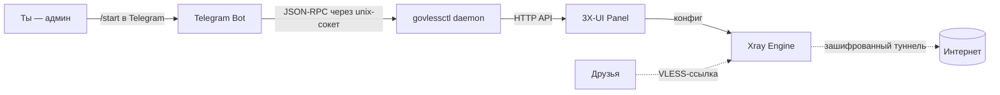
```mermaid
flowchart LR
    U[Ты — админ] -->|/start в Telegram| TG[Telegram Bot]
    TG -->|JSON-RPC через unix-сокет| C[govlessctl daemon]
    C -->|HTTP API| X[3X-UI Panel]
    X -->|конфиг| XR[Xray Engine]
    F[Друзья] -.->|VLESS-ссылка| XR
    XR -.->|зашифрованный туннель| I[(Интернет)]
```

### Из чего состоит проект

| Слой | Что | Папка в репо |
|------|-----|--------------|
| **bash-инсталлер** | ставит 3X-UI, настраивает inbound, выдаёт первые ключи | корень: `govless.sh`, `lib/` |
| **govlessctl** | Python-демон-«мозг»: единая точка для бота, WebApp и CLI | `phase-a/govlessctl/` |
| **Telegram-бот** | aiogram v3, всё управление через чат | `phase-a/bot/` |
| **WebApp** | мини-веб-приложение внутри Telegram | `phase-a/webapp/` |
| **systemd-юниты** | автозапуск, безопасность, восстановление туннеля | `phase-a/systemd/` |

### Два режима маскировки

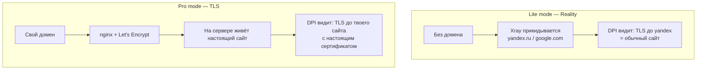
```mermaid
flowchart TB
    subgraph Lite["Lite mode — Reality"]
        L1[Без домена] --> L2[Xray прикидывается<br/>yandex.ru / google.com]
        L2 --> L3[DPI видит: TLS до yandex<br/>= обычный сайт]
    end
    subgraph Pro["Pro mode — TLS"]
        P1[Свой домен] --> P2[nginx + Let's Encrypt]
        P2 --> P3[На сервере живёт настоящий сайт]
        P3 --> P4[DPI видит: TLS до твоего сайта<br/>с настоящим сертификатом]
    end
```

- **Lite (Reality)** — ставится мгновенно, без домена. DPI видит обычный TLS-трафик к реальному сайту. Минус: на некоторых сетях (особенно мобильных) Reality всё-таки палится.
- **Pro (TLS)** — нужен домен. На сервере живёт настоящий сайт, и весь VPN-трафик прячется в HTTPS к нему. Снаружи это выглядит как обычный сайт с обычным сертификатом — DPI ничего не отличит.

### Три транспорта

| Транспорт | Кому подходит | Особенности |
|-----------|--------------|-------------|
| **TCP** | большинству | простой, надёжный, рекомендуется по умолчанию |
| **XHTTP** | мобильным сетям с агрессивным DPI | маскируется под HTTP/2 + WebSocket |
| **gRPC** | сетям с глубокой инспекцией | использует gRPC-frames, выглядит как Google API |

### Возможности из коробки (v1.0-rc1)

- ✅ Установка одной командой с обязательным правовым disclaimer
- ✅ Lite (Reality, без домена) + Pro (TLS, с доменом)
- ✅ TCP / XHTTP / gRPC транспорты
- ✅ От 1 до 100 VPN-ключей при первой установке
- ✅ Каталог ~1800 готовых HTML-шаблонов сайтов для Pro с retry-меню при ошибке ввода
- ✅ **Бесшовное переключение Lite ↔ Pro** с сохранением UUID/email/subId/traffic + rollback
- ✅ **Subscription URLs** на random port + random path — клиенту даёшь один QR, он сам обновляется
- ✅ **Backup / Restore** WAL-safe прямо из меню
- ✅ **Repair** — самовосстановление IP / sub-server / links без снос
- ✅ **Granular Remove** — только сайт / только панель / всё с логами, typed-confirm + failure summary
- ✅ Telegram-бот с админкой (поддержка 3X-UI v2.x Legacy и v3.x NewGen)
- ✅ WebApp (мини-веб-приложение в Telegram) с typed-confirm через 412 RPC
- ✅ CLI `govlessctl`
- ✅ Cloudflare Quick Tunnel для случаев когда панель не должна торчать
- ✅ Автопродление Let's Encrypt + deploy_hook автоматически перезапускает x-ui
- ✅ nginx security headers (HSTS, X-Frame-Options, X-Content-Type-Options, Referrer-Policy, Permissions-Policy)
- ✅ HMAC-аутентификация всех Telegram WebApp запросов
- ✅ Аудит-лог 90 дней с авто-prune
- ✅ Disclaimer (РФ-юридический для RU, country-neutral для EN), accept marker

### Что НЕ умеет (пока)

- Биллинг / подписки
- Несколько серверов в одной админке
- Лимиты трафика по тарифам автоматически (но можно вручную через 3X-UI)
- Push-уведомления о квотах
- Backup в облако (только локально в `/root/govless-backups/`)
- ARM64 ещё не верифицирован на тестах (Phase B)
- HMAC chain в audit_log (защита от root tampering) — Phase B
- fail2ban / SSH brute-force protection — операторская задача

### История

| Дата | Что |
|------|-----|
| 2025 → начало 2026 | проект назывался **XUIFAST**, был только bash-инсталлер |
| Февраль 2026 | ребрендинг → **goVLESS**, приватный репо `anten-ka/goVLESS` |
| Май 2026 | **Phase A**: govlessctl + Telegram-бот + WebApp + systemd |
| TBD | **Phase B**: квоты, push, мультисервер |

---

## 2. Установка с нуля

### Что понадобится

- VPS с Ubuntu 22/24 или Debian 11/12 (минимум 1 GB RAM)
- Публичный IPv4
- root-доступ
- Telegram-аккаунт (свой и BotFather)
- (опционально) домен для Pro-режима
- 10 минут

### Шаг 1. Создай Telegram-бота

1. Открой [@BotFather](https://t.me/BotFather)
2. `/newbot` → имя → username
3. Сохрани **HTTP API token** — `8850029626:AAFJo4D...`

### Шаг 2. Зайди на VPS и поставь bash-инсталлер

```bash
ssh root@<твой-ip>

bash <(curl -sL https://raw.githubusercontent.com/anten-ka/goVLESS/main/bootstrap.sh)
```

Ответь:
- язык: Russian / English
- **Disclaimer**: новый правовой gate (RU — полный РФ-контекст, EN — neutral). Прочитай → `y` → принято навсегда (marker в `/opt/govless/.disclaimer-accepted`)
- режим: Lite / Pro
- сколько ключей: 3 (по умолчанию) до 100
- версия 3X-UI: **NewGen 3.x** (рекомендуется) или **Legacy 2.9.4** (тестировано на release-gate)
- транспорт: TCP / XHTTP / gRPC
- (Pro) домен + email (DNS-wait с countdown 30 мин если домен ещё не указывает на VPS) + шаблон сайта (с retry на invalid input)

Через 3-7 минут получишь **QR-коды + subscription URL + логин-пароль панели**.

📌 Subscription URL — рекомендуется раздавать клиентам вместо прямого vless-ключа: при переключении Lite↔Pro подписка автоматически обновится на стороне клиента.

### Шаг 3. Поставь Phase A (бот + WebApp + CLI)

```bash
cd /opt/govless-installer
sudo bash phase-a/systemd/install/install_phase_a.sh
```

Скрипт спросит BOT_TOKEN и хочешь ли Cloudflare Quick Tunnel.

### Шаг 4. Назначь себя администратором

Открой бота, напиши `/start`.

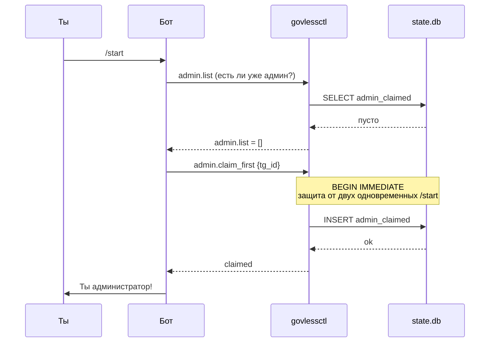
```mermaid
sequenceDiagram
    participant U as Ты
    participant B as Бот
    participant D as govlessctl
    participant DB as state.db
    U->>B: /start
    B->>D: admin.list (есть ли уже админ?)
    D->>DB: SELECT admin_claimed
    DB-->>D: пусто
    D-->>B: admin.list = []
    B->>D: admin.claim_first {tg_id}
    Note over D,DB: BEGIN IMMEDIATE<br/>защита от двух одновременных /start
    D->>DB: INSERT admin_claimed
    DB-->>D: ok
    D-->>B: claimed
    B->>U: Ты администратор!
```

⚠️ **«Первый /start = админ»**: даёт админа **первому**, кто нажал `/start`. Поэтому: установил → сразу `/start`.

### Где что лежит после установки

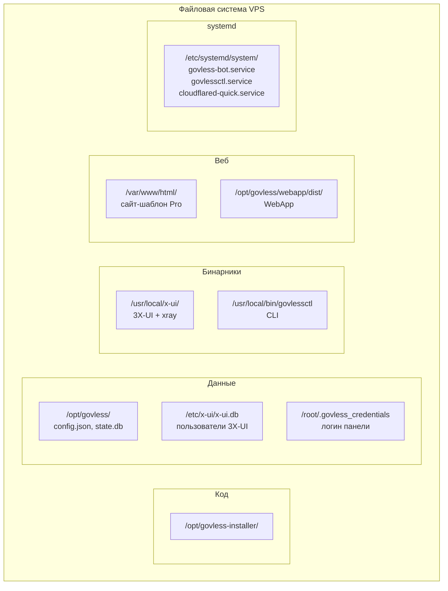
```mermaid
flowchart TB
    subgraph FS["Файловая система VPS"]
        subgraph Code["Код"]
            A["/opt/govless-installer/"]
        end
        subgraph Data["Данные"]
            B["/opt/govless/<br/>config.json, state.db"]
            C["/etc/x-ui/x-ui.db<br/>пользователи 3X-UI"]
            D["/root/.govless_credentials<br/>логин панели"]
        end
        subgraph Bin["Бинарники"]
            E["/usr/local/x-ui/<br/>3X-UI + xray"]
            F["/usr/local/bin/govlessctl<br/>CLI"]
        end
        subgraph Web["Веб"]
            G["/var/www/html/<br/>сайт-шаблон Pro"]
            H["/opt/govless/webapp/dist/<br/>WebApp"]
        end
        subgraph SD["systemd"]
            I["/etc/systemd/system/<br/>govless-bot.service<br/>govlessctl.service<br/>cloudflared-quick.service"]
        end
    end
```

---


## 2.5. Подписка vs Прямая VLESS-ссылка

Каждому клиенту goVLESS выдаёт **две формы ключа** — выбор зависит от сценария.

### Подписка (subscription URL) — РЕКОМЕНДУЕТСЯ

```
http://<server-IP-или-domain>:<sub_port>/<sub_path>/<UUID>
```

Где:
- `sub_port` — случайный (20000-65000), генерится при install, лежит в `config.json`
- `sub_path` — случайный 16-символьный путь, лежит в `config.json`
- `UUID` — идентификатор клиента (он же `subId` в 3X-UI)

**Плюсы:**
- ✅ Один QR — клиент в Hiddify / V2RayNG / Streisand добавляет подписку и ВСЁ
- ✅ При смене режима Lite↔Pro подписка **автоматически обновится** на клиенте (он сам перетягивает свежий конфиг при refresh)
- ✅ Случайные port + path = подписка не находится сканом, даже без auth

**Минусы:**
- ⚠️ HTTP, не HTTPS (3X-UI sub-server без TLS — мы не настраиваем cert на random port). Содержимое = VLESS-конфиг (UUID), уже pre-shared, поэтому риск низкий. v2-фича — HTTPS через nginx proxy на :443.

### Прямая VLESS-ссылка

```
vless://UUID@server:443?type=tcp&security=reality&...
vless://UUID@domain:443?type=tcp&security=tls&...
```

**Плюсы:**
- ✅ Не требует sub-server — работает «здесь и сейчас»
- ✅ Понятно «что под капотом» — UUID, host, security видны в URL

**Минусы:**
- ⚠️ При переключении Lite↔Pro **ссылка меняется** — нужно перевыдавать клиентам
- ⚠️ Содержит весь конфиг в URL (длинная строка)

### Как выбрать что показать клиенту

В меню `Users → 3 Show QR` для каждого клиента спрашивает:

```
Что отдать клиенту?
  1) Подписку (рекомендуется) — один QR, автообновление при смене режима
  2) Прямую ссылку VLESS — разовый ключ, не обновляется
  3) Показать оба
```

По умолчанию (`Enter`) — подписка.

---

## 3. Telegram-бот

### Что умеет бот

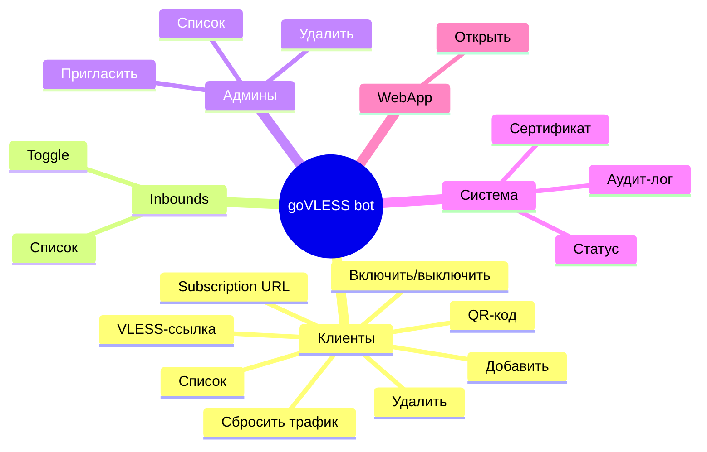
```mermaid
mindmap
  root((goVLESS bot))
    Клиенты
      Список
      Добавить
      Удалить
      Включить/выключить
      Сбросить трафик
      QR-код
      VLESS-ссылка
      Subscription URL
    Inbounds
      Список
      Toggle
    Админы
      Список
      Пригласить
      Удалить
    Система
      Статус
      Аудит-лог
      Сертификат
    WebApp
      Открыть
```

### Команды

| Команда | Что делает |
|---------|-----------|
| `/start` | приветствие + меню (первый раз — назначает админом) |
| `/menu` | главное меню |
| `/clients` | список клиентов |
| `/add_client <имя>` | добавить клиента |
| `/admins` | список администраторов |
| `/invite <tg_id>` | пригласить админа |
| `/status` | статус системы |
| `/audit [N]` | последние N записей аудита |
| `/webapp` | ссылка на WebApp |
| `/admin <token>` | резервный путь стать админом |
| `/help` | список команд |

### Сценарий: добавить друга

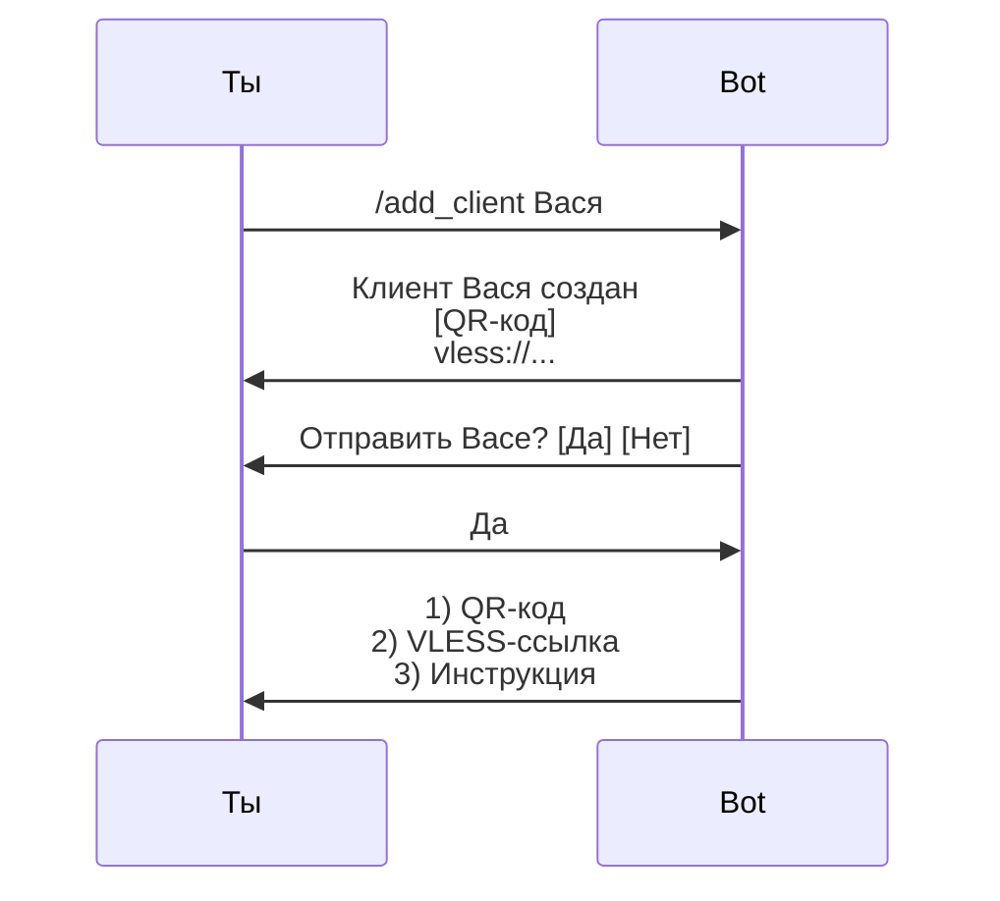
```mermaid
sequenceDiagram
    participant Ты
    participant Bot
    Ты->>Bot: /add_client Вася
    Bot->>Ты: Клиент Вася создан<br/>[QR-код]<br/>vless://...
    Bot->>Ты: Отправить Васе? [Да] [Нет]
    Ты->>Bot: Да
    Bot->>Ты: 1) QR-код<br/>2) VLESS-ссылка<br/>3) Инструкция
```

### Typed-confirm для удаления

```
[Ты] [Удалить Васю]

[Bot] Подтверди удаление клиента «Вася»
      Введи ТОЧНО: DELETE Вася
      У тебя 60 секунд.

[Ты] DELETE Вася

[Bot] Удалён.
```

Защита от случайных нажатий и от prompt injection.

### Безопасность бота

- Только админы что-то могут.
- Деструктив требует typed-confirm.
- Аудит-лог пишет всё.
- HMAC на каждом RPC.

---

## 4. WebApp

### Что это

Telegram умеет показывать мини-приложения внутри чата. WebApp goVLESS = панель администратора, открывается прямо в Telegram.

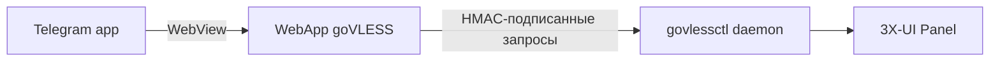
```mermaid
flowchart LR
    TG[Telegram app] -->|WebView| WA[WebApp goVLESS]
    WA -->|HMAC-подписанные запросы| C[govlessctl daemon]
    C --> X[3X-UI Panel]
```

### Как открыть

- Кнопка **«Открыть WebApp»** в боте
- Команда `/webapp`
- Прямой URL (если знаешь)

### Что внутри (6 экранов)

- **Дашборд** — сводка
- **Клиенты** — таблица с фильтрами
- **Карточка клиента** — детали, QR, действия, графики трафика
- **Inbounds** — список и переключение
- **Админы** — управление
- **Система** — статус, сертификат, аудит

### Подтверждение опасных действий

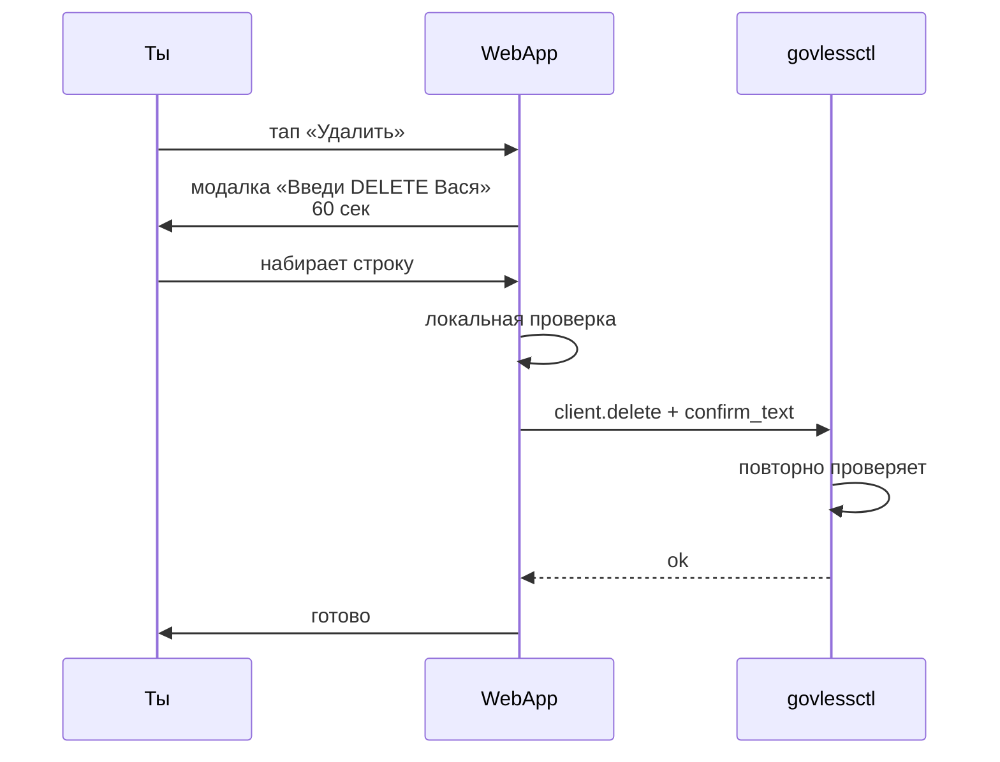
```mermaid
sequenceDiagram
    participant U as Ты
    participant W as WebApp
    participant D as govlessctl
    U->>W: тап «Удалить»
    W->>U: модалка «Введи DELETE Вася»<br/>60 сек
    U->>W: набирает строку
    W->>W: локальная проверка
    W->>D: client.delete + confirm_text
    D->>D: повторно проверяет
    D-->>W: ok
    W->>U: готово
```

### Аутентификация

Без формы логина. Telegram передаёт `initData` с HMAC-SHA256 подписью BOT_TOKEN'ом. govlessctl проверяет на каждом запросе.

### Где живёт

- HTML/CSS/JS: `/opt/govless/webapp/dist/`
- nginx: `phase-a/systemd/nginx/govless-webapp.conf`
- внутренний URL: `http://127.0.0.1:8090`
- внешний URL: Cloudflare Quick Tunnel или свой домен с TLS

---

## 5. CLI `govlessctl`

### Зачем

- Автоматизация (cron)
- Debug
- Первый старт до настройки бота
- Резервный путь

### Основной паттерн

```bash
govlessctl <method> [--arg key=value] [--arg key=value]
```

### Шпаргалка

```bash
# Клиенты
govlessctl client.list
govlessctl client.add --arg name="Вася"
govlessctl client.disable --arg name="Вася"
govlessctl client.delete --arg name="Вася" --arg confirm="DELETE Вася"
govlessctl client.qr --arg name="Вася" | jq -r .png_b64 | base64 -d > qr.png

# Inbounds
govlessctl inbound.list
govlessctl inbound.toggle --arg port=443 --arg enable=false

# Админы
govlessctl admin.list
govlessctl admin.invite --arg tg_id=123456789

# Система
govlessctl system.status
govlessctl audit.tail --arg limit=20
govlessctl cert.force_renew

# Туннель
govlessctl tunnel.url_get
```

### Пример: cron-уведомление о новых клиентах

```bash
#!/bin/bash
new=$(govlessctl client.list | jq "[.[] | select(.created_at > (now - 86400))] | length")
if [ "$new" -gt 0 ]; then
    curl -X POST -d "{\"text\":\"+$new клиентов за сутки\"}" "$SLACK_WEBHOOK"
fi
```

```cron
0 9 * * * root /usr/local/bin/govless-daily.sh
```

---

## 6. Как это устроено внутри

### Общая картина

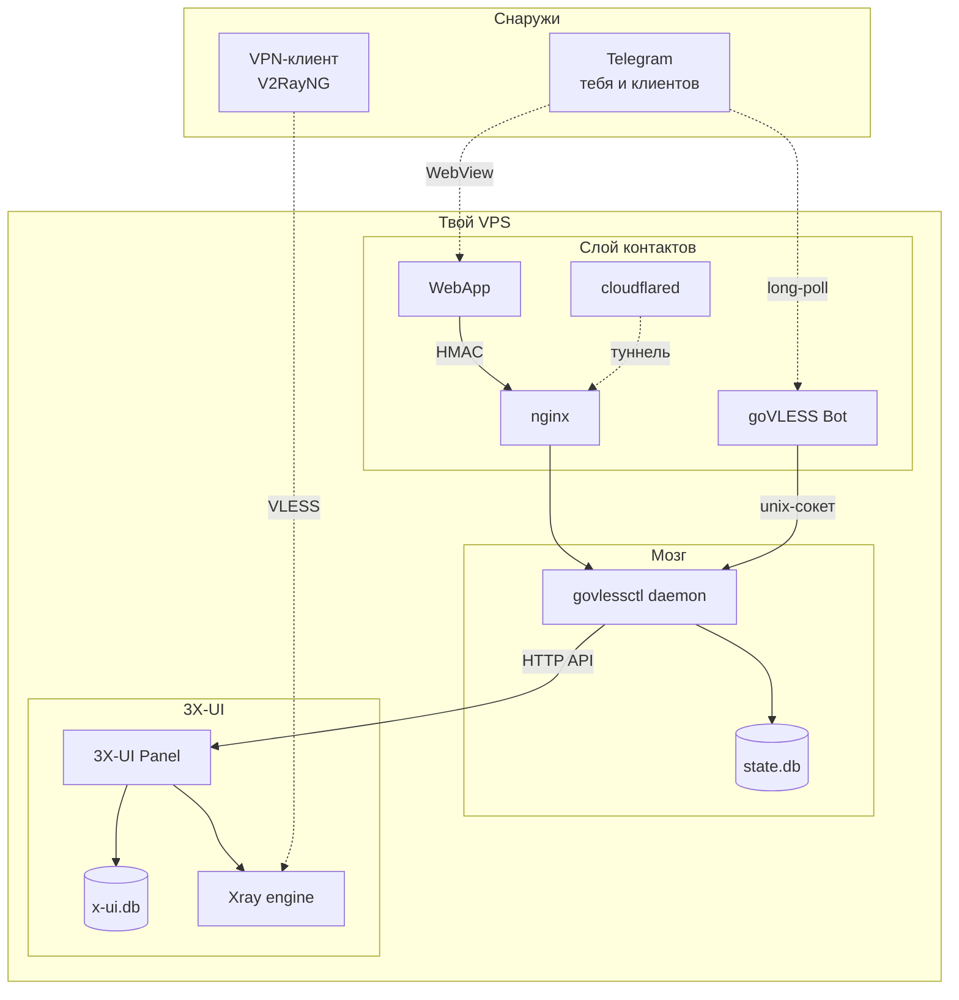
```mermaid
flowchart TB
    subgraph Outside["Снаружи"]
        TG[Telegram<br/>тебя и клиентов]
        TC[VPN-клиент<br/>V2RayNG]
    end

    subgraph VPS["Твой VPS"]
        subgraph Frontend["Слой контактов"]
            BOT[goVLESS Bot]
            WA[WebApp]
            NG[nginx]
            CF[cloudflared]
        end

        subgraph Core["Мозг"]
            D[govlessctl daemon]
            ST[(state.db)]
        end

        subgraph Panel["3X-UI"]
            X[3X-UI Panel]
            XD[(x-ui.db)]
            XR[Xray engine]
        end
    end

    TG -.->|long-poll| BOT
    TG -.->|WebView| WA
    WA -->|HMAC| NG
    NG --> D
    BOT -->|unix-сокет| D
    D -->|HTTP API| X
    X --> XD
    X --> XR
    D --> ST
    TC -.->|VLESS| XR
    CF -.->|туннель| NG
```

### Кто чем занят

- **goVLESS Bot** — фронтенд. Хранит токен в `/etc/govless/bot.env`. Логики управления НЕТ, всё через govlessctl.
- **WebApp** — vanilla HTML/CSS/JS. Открывается в Telegram. Шлёт `initData` с HMAC.
- **govlessctl** — мозг. JSON-RPC сервер. Единственный, кто что-то меняет.
- **state.db** — SQLite goVLESS: админы, аудит, токены подписок.
- **3X-UI + x-ui.db** — источник истины для VPN.
- **Xray** — сам трубопровод, шифрует/расшифровывает.

### Жизненный цикл действия (пример: «добавить клиента»)

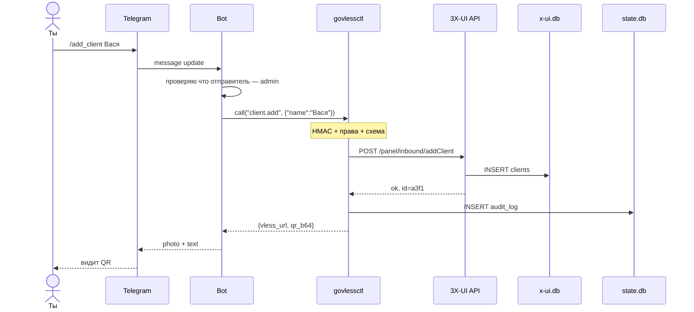
```mermaid
sequenceDiagram
    actor U as Ты
    participant TG as Telegram
    participant B as Bot
    participant D as govlessctl
    participant XAPI as 3X-UI API
    participant XDB as x-ui.db
    participant SDB as state.db
    U->>TG: /add_client Вася
    TG->>B: message update
    B->>B: проверяю что отправитель — admin
    B->>D: call("client.add", {"name":"Вася"})
    Note over D: HMAC + права + схема
    D->>XAPI: POST /panel/inbound/addClient
    XAPI->>XDB: INSERT clients
    XAPI-->>D: ok, id=a3f1
    D->>SDB: INSERT audit_log
    D-->>B: {vless_url, qr_b64}
    B-->>TG: photo + text
    TG-->>U: видит QR
```

Бот **никогда** не пишет напрямую ни в одну из БД.

### Защита от плохих сценариев

**Двое нажали /start одновременно** → SQLite `BEGIN IMMEDIATE` блокировка: один INSERT, второй ROLLBACK с 409 Conflict.

**Кто-то прислал в чат «удали всё»** → команды только из своих сообщений, деструктив требует typed-confirm с уникальной строкой (`DELETE <name>`).

**Подделать HMAC** → невозможно без BOT_TOKEN, который `600` в `/etc/govless/bot.env`.

### Восстановление туннеля

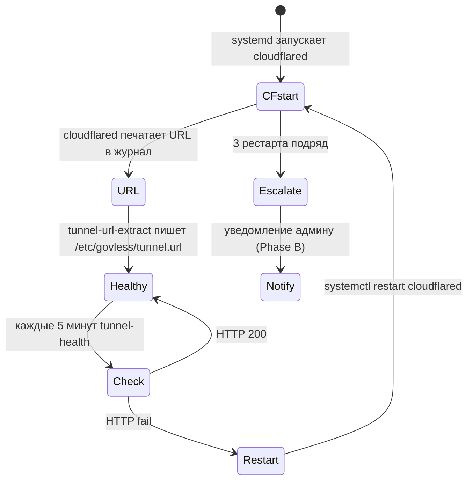
```mermaid
stateDiagram-v2
    [*] --> CFstart: systemd запускает cloudflared
    CFstart --> URL: cloudflared печатает URL в журнал
    URL --> Healthy: tunnel-url-extract пишет /etc/govless/tunnel.url
    Healthy --> Check: каждые 5 минут tunnel-health
    Check --> Healthy: HTTP 200
    Check --> Restart: HTTP fail
    Restart --> CFstart: systemctl restart cloudflared
    CFstart --> Escalate: 3 рестарта подряд
    Escalate --> Notify: уведомление админу (Phase B)
```

---

## 7. Обслуживание сервера

### Регулярные действия

| Что | Как часто | Автомат / руками |
|-----|-----------|-----------------|
| `apt update && apt upgrade` | раз в 2-4 недели | руками |
| Бэкап `/opt/govless/`, `/etc/x-ui/`, `/etc/govless/` | раз в неделю | скрипт ниже |
| Чистка аудит-лога >90 дней | автоматически | timer |
| Продление LE | автоматически | certbot/acme.sh |
| Восстановление туннеля | автоматически | tunnel-health.timer |

### Бэкап через меню (v1.0-rc1+)

Проще всего:

```
govless → 3 Manage → 4 Backup
```

Создаст `/root/govless-backups/govless-YYYYMMDDTHHMMSSZ.tgz` со всем нужным:

```
/etc/x-ui/x-ui.db + .db-wal + .db-shm  ← WAL-safe (PRAGMA wal_checkpoint TRUNCATE)
/opt/govless/state.db + .db-wal + .db-shm
/opt/govless/config.json
/etc/govless/bot.env (BOT_TOKEN)
/etc/govless/tunnel.url
/root/.govless_credentials
```

Восстановление:
```
govless → 3 Manage → 5 Restore → выбрать timestamp из списка
```

Автоматически останавливает сервисы → tar xzf → восстанавливает права (600 для bot.env / credentials) → стартует. Подсказывает запустить Repair если что-то выглядит stale.

### Бэкап через cron на ноуте (старый способ — всё ещё работает)

Скрипт на ноуте:

```bash
#!/bin/bash
DATE=$(date +%Y%m%d-%H%M)
ssh root@<vps> "tar czf - /etc/x-ui/x-ui.db /opt/govless/state.db \
    /etc/govless/bot.env /etc/letsencrypt /root/.govless_credentials 2>/dev/null" \
    > ~/govless-backups/backup-$DATE.tar.gz
```

```cron
0 4 * * 0 /home/you/govless-backup.sh
```

### Восстановление

```bash
# 1. Поставь чистый goVLESS
# 2. systemctl stop govless-bot govlessctl x-ui
# 3. cd / && tar xzf backup.tar.gz
# 4. chown govless:govless /opt/govless/state.db
#    chmod 600 /etc/govless/bot.env /root/.govless_credentials
# 5. systemctl start x-ui govlessctl govless-bot
```

### Обновление кода

```bash
cd /opt/govless-installer
git pull
sudo bash phase-a/systemd/install/install_phase_a.sh --update
```

Идемпотентно — данные не потеряются.

### Обновление 3X-UI

```bash
x-ui  # → Update
systemctl restart govlessctl  # ОБЯЗАТЕЛЬНО — API мог поменяться
```

### Мониторинг

```bash
systemctl status x-ui govlessctl govless-bot cloudflared-quick

journalctl -u govless-bot -n 100 --no-pager
journalctl -u govlessctl -n 100 --no-pager
```

### Удаление goVLESS

```bash
systemctl stop govless-bot govlessctl cloudflared-quick govless-webapp
systemctl disable govless-bot govlessctl cloudflared-quick govless-webapp
rm -rf /opt/govless /opt/govless-installer /etc/govless
rm /etc/systemd/system/govless-*.{service,timer}
rm /etc/systemd/system/cloudflared-*.{service,path}
rm /etc/systemd/system/tunnel-health.{service,timer}
rm /usr/local/bin/govlessctl
rm /etc/nginx/sites-enabled/govless-webapp.conf
userdel govless 2>/dev/null
systemctl daemon-reload
systemctl reload nginx
```

---

## 8. Траблшутинг

### Метод диагностики

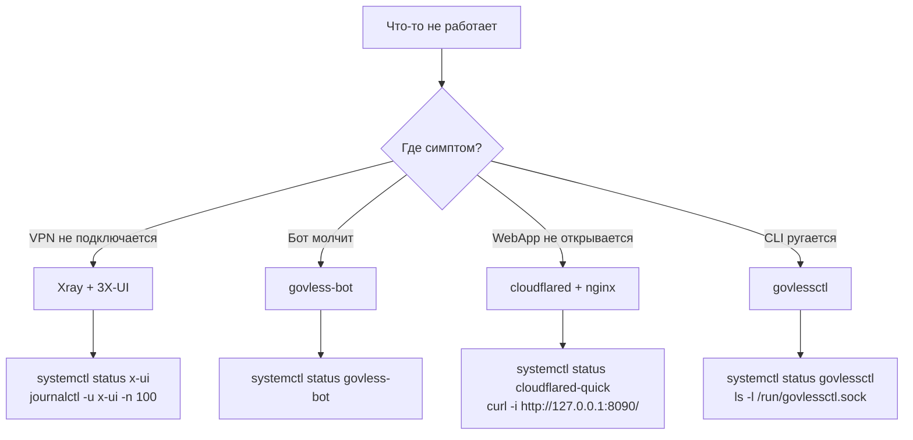
```mermaid
flowchart TD
    A[Что-то не работает] --> B{Где симптом?}
    B -->|VPN не подключается| V[Xray + 3X-UI]
    B -->|Бот молчит| BT[govless-bot]
    B -->|WebApp не открывается| WA[cloudflared + nginx]
    B -->|CLI ругается| CL[govlessctl]
    V --> CMD["systemctl status x-ui<br/>journalctl -u x-ui -n 100"]
    BT --> CMD2["systemctl status govless-bot"]
    WA --> CMD3["systemctl status cloudflared-quick<br/>curl -i http://127.0.0.1:8090/"]
    CL --> CMD4["systemctl status govlessctl<br/>ls -l /run/govlessctl.sock"]
```

### Установка

| Симптом | Решение |
|---------|---------|
| Port 80/443 занят | `lsof -i :80` → останови apache/nginx |
| Domain doesn't point to IP | `dig +short domain.com` → проверь A-запись |
| /start не сработал | `sqlite3 /opt/govless/state.db "DELETE FROM admin_claimed; DELETE FROM govless_admins;"` затем рестарт + новый /start |

### Бот

| Лог | Решение |
|-----|---------|
| `BOT_TOKEN missing` | `nano /etc/govless/bot.env` |
| `TelegramUnauthorizedError` | BOT_TOKEN неправильный |
| `Connection refused: /run/govlessctl.sock` | `systemctl start govlessctl` |
| `ModuleNotFoundError` | reinstall phase-a |

### WebApp

| Симптом | Решение |
|---------|---------|
| «Не удалось загрузить» | `systemctl restart cloudflared-quick; sleep 10; cat /etc/govless/tunnel.url` |
| Пустая страница | `curl -i http://127.0.0.1:8090/app.js` |
| 401 на запросах | BOT_TOKEN не совпадает с тем что в Telegram |

### VPN

```bash
pgrep -af xray-linux-amd64    # бежит?
ss -tnlp | grep -E ':443|:8443'  # порт открыт?
ufw status                     # firewall?
x-ui restart                   # перезапуск
```

### Сертификат

```bash
govlessctl cert.force_renew
# если ругается:
curl -i http://domain.com/.well-known/acme-challenge/test
```

### Полный фейл — переустановка

```bash
# 0. Бэкап (см. §7)
x-ui uninstall
bash <(curl -sL https://raw.githubusercontent.com/anten-ka/goVLESS/main/bootstrap.sh)
# Restore из бэкапа
```

---

## 9. Безопасность

### Модель угроз

Защищает от:
- DPI (Reality / TLS-маскировка)
- Случайных нажатий (typed-confirm)
- Подделки запросов (HMAC)
- Захвата админа (атомарная first-/start)
- Расширения прав (systemd hardening)
- Утечек через web (статика only)

НЕ защищает от:
- Компромисса VPS root
- Уязвимостей в 3X-UI / Xray (обновляй)
- Уязвимостей в ядре Linux (обновляй)
- Кражи Telegram-аккаунта

### Главные защиты

**1. HMAC initData** — каждый WebApp-запрос подписан BOT_TOKEN'ом, `auth_date` не старше 5 мин.

**2. Typed-confirm** — деструктив требует точную строку (`DELETE <name>`), проверяется и на клиенте, и на сервере.

**3. Atomic first-/start** — `BEGIN IMMEDIATE` транзакция гарантирует одного админа.

**4. Audit 90d** — каждое действие пишется в SQLite, prune timer чистит старое.

**5. systemd hardening**:
```ini
User=govless
NoNewPrivileges=yes
ProtectSystem=strict
ProtectHome=yes
PrivateTmp=yes
ReadOnlyPaths=/etc/govless
RestrictSUIDSGID=yes
```

**6. Unix-сокет `/run/govlessctl.sock` 660** — только govless-пользователь.

### Регулярные действия

| Действие | Зачем | Как часто |
|----------|-------|-----------|
| `apt upgrade` | патчи ядра/SSL | раз в месяц |
| Обновлять 3X-UI / Xray | патчи протокола | раз в квартал |
| Менять BOT_TOKEN | если был утёк | по событию |
| Менять пароль панели | гигиена | раз в полгода |
| Проверять `/audit` | заметить аномалии | раз в неделю |
| Бэкап | от потери | раз в неделю |

### Подозрение на компромисс

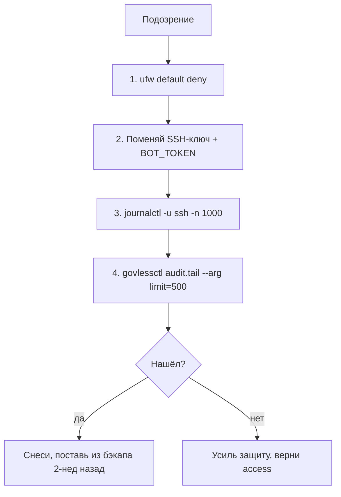
```mermaid
flowchart TD
    A[Подозрение] --> B[1. ufw default deny]
    B --> C[2. Поменяй SSH-ключ + BOT_TOKEN]
    C --> D[3. journalctl -u ssh -n 1000]
    D --> E[4. govlessctl audit.tail --arg limit=500]
    E --> F{Нашёл?}
    F -->|да| H[Снеси, поставь из бэкапа 2-нед назад]
    F -->|нет| I[Усиль защиту, верни access]
```

### Известные ограничения Phase A

| Ограничение | Митигация |
|-------------|-----------|
| Аудит не подписан криптографически | + бэкап |
| Нет 2FA на админах | защита через Telegram-аккаунт |
| Нет push'а об обновлениях | бот пришлёт (Phase B) |
| Cloudflare Quick = доверие CF | используй свой домен для Pro |
| state.db без репликации | бэкап |

---
---

# 🇬🇧 Part 2 — for AI / contributors

## 10. System overview

### One-liner

goVLESS is a Telegram-managed VPN service. It bundles 3X-UI panel + Xray-core (VLESS/Reality/TLS) with a Python control plane that exposes a JSON-RPC API used by a Telegram bot, a WebApp, and a CLI.

### Two-tier architecture

- **Tier 1 — bash installer** (`govless.sh`, `lib/`): one-shot setup of 3X-UI, Xray, inbounds, nginx (Pro), Let's Encrypt (Pro). Pre-Phase-A historical part — handles operating-system-level provisioning.
- **Tier 2 — Phase A control plane** (`phase-a/`): adds govlessctl daemon, Telegram bot, WebApp, systemd units. Hot path for runtime management.

This document focuses on Tier 2.

### Components at a glance

| Component | Path | Lang | Lines |
|-----------|------|------|-------|
| govlessctl daemon | `phase-a/govlessctl/` | Python 3.10+ | ~1800 |
| Telegram bot | `phase-a/bot/` | Python (aiogram v3) | ~1800 |
| WebApp | `phase-a/webapp/dist/` | vanilla HTML/CSS/JS | ~600 JS |
| systemd units | `phase-a/systemd/` | systemd + bash | 10 units + 5 scripts |
| Install scripts | `phase-a/systemd/install/` | bash | ~600 |

### Process model

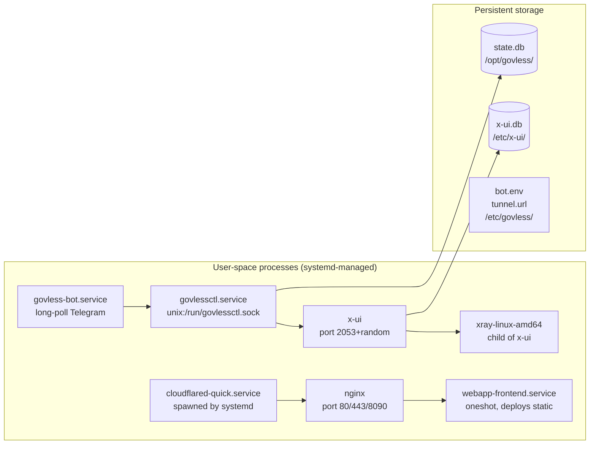
```mermaid
flowchart LR
    subgraph User_space["User-space processes (systemd-managed)"]
        XU[x-ui<br/>port 2053+random]
        XR[xray-linux-amd64<br/>child of x-ui]
        D[govlessctl.service<br/>unix:/run/govlessctl.sock]
        B[govless-bot.service<br/>long-poll Telegram]
        N[nginx<br/>port 80/443/8090]
        CF[cloudflared-quick.service<br/>spawned by systemd]
        WA[webapp-frontend.service<br/>oneshot, deploys static]
    end

    subgraph Storage["Persistent storage"]
        XDB[(x-ui.db<br/>/etc/x-ui/)]
        SDB[(state.db<br/>/opt/govless/)]
        CFG[bot.env<br/>tunnel.url<br/>/etc/govless/]
    end

    B --> D
    D --> XU
    XU --> XR
    XU --> XDB
    D --> SDB
    N --> WA
    CF --> N
```

### External interfaces

- **Telegram Bot API** (HTTPS to api.telegram.org) — outbound only, long-poll.
- **3X-UI HTTP API** — localhost, port 2053+random, basic+session auth.
- **Cloudflare Quick Tunnel** — outbound to `*.cloudflare.com`; Cloudflare proxies public requests back to localhost:8090 via the tunnel.
- **Let's Encrypt ACME** — outbound to `acme-v02.api.letsencrypt.org` (Pro only).
- **VLESS clients** — inbound to public IP, ports 443 / 8443 etc.

### Version & release model

- Single `main` branch in private repo `anten-ka/goVLESS`.
- Public releases via cherry-pick / squash-merge to a public mirror (TBD) + GitHub Release with `GOVLESS_VERSION` bump in `lib/common.sh`.
- AI agents do NOT push to a public mirror without explicit human approval.

### History of decisions (where to look)

All architectural decisions are persisted in `ai-bridge/claude-codex/` as numbered bridge files:

- 001 — rebrand XUIFAST → goVLESS
- 012, 016 — Reviewer (Codex) adversarial audits
- 013, 017 — Architect (Claude) responses
- 014 — Telegram bot proposal v2

Read these before changing security-sensitive code.

---

## 11. Architecture

### Layered view

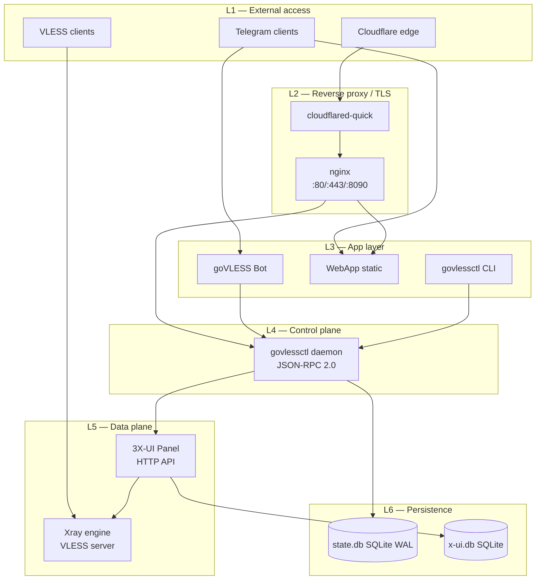
```mermaid
flowchart TB
    subgraph L1["L1 — External access"]
        TG[Telegram clients]
        TC[VLESS clients]
        CFP[Cloudflare edge]
    end

    subgraph L2["L2 — Reverse proxy / TLS"]
        N[nginx<br/>:80/:443/:8090]
        CF[cloudflared-quick]
    end

    subgraph L3["L3 — App layer"]
        B[goVLESS Bot]
        WA[WebApp static]
        CLI[govlessctl CLI]
    end

    subgraph L4["L4 — Control plane"]
        D[govlessctl daemon<br/>JSON-RPC 2.0]
    end

    subgraph L5["L5 — Data plane"]
        XU[3X-UI Panel<br/>HTTP API]
        XR[Xray engine<br/>VLESS server]
    end

    subgraph L6["L6 — Persistence"]
        SDB[(state.db SQLite WAL)]
        XDB[(x-ui.db SQLite)]
    end

    TG --> B
    TG --> WA
    TC --> XR
    CFP --> CF
    CF --> N
    N --> WA
    N --> D
    B --> D
    CLI --> D
    D --> XU
    D --> SDB
    XU --> XR
    XU --> XDB
```

### Trust boundaries

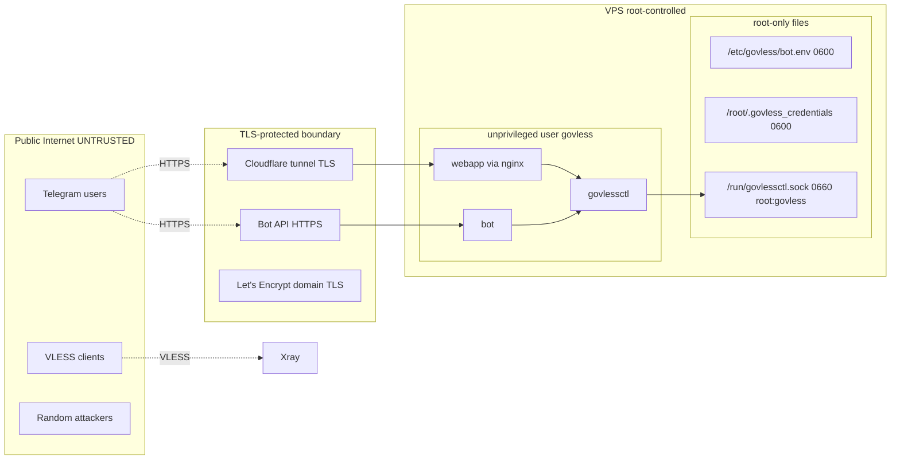
```mermaid
flowchart LR
    subgraph PublicInternet["Public Internet UNTRUSTED"]
        T1[Telegram users]
        T2[VLESS clients]
        T3[Random attackers]
    end

    subgraph TLSLayer["TLS-protected boundary"]
        E1[Bot API HTTPS]
        E2[Cloudflare tunnel TLS]
        E3[Let's Encrypt domain TLS]
    end

    subgraph VPS["VPS root-controlled"]
        subgraph TrustedUser["unprivileged user govless"]
            D[govlessctl]
            B[bot]
            WA[webapp via nginx]
        end
        subgraph RootOnly["root-only files"]
            BE["/etc/govless/bot.env 0600"]
            SC["/root/.govless_credentials 0600"]
            SOC["/run/govlessctl.sock 0660 root:govless"]
        end
    end

    T1 -.->|HTTPS| E1 --> B
    T1 -.->|HTTPS| E2 --> WA
    T2 -.->|VLESS| XR[Xray]
    WA --> D
    B --> D
    D --> SOC
```

Key invariant: **no internet-facing service writes to state.db or x-ui.db directly**. Everything funnels through govlessctl, which enforces HMAC + admin checks before mutating state.

### Concurrency model

- **govlessctl** — single Python asyncio event loop, aiohttp UNIX-socket server. One worker, no fork. Concurrent RPCs handled cooperatively. SQLite serializes writes via `BEGIN IMMEDIATE` where atomicity matters.
- **bot** — single aiogram dispatcher, long-poll. Bot handlers `await` govlessctl RPC; no per-user state machines beyond aiogram's FSMContext for typed-confirm prompts.
- **nginx** — multi-worker default, but only proxies WebApp.
- **xray** — managed by x-ui as a separate process.

### State machines

**Admin claim:**

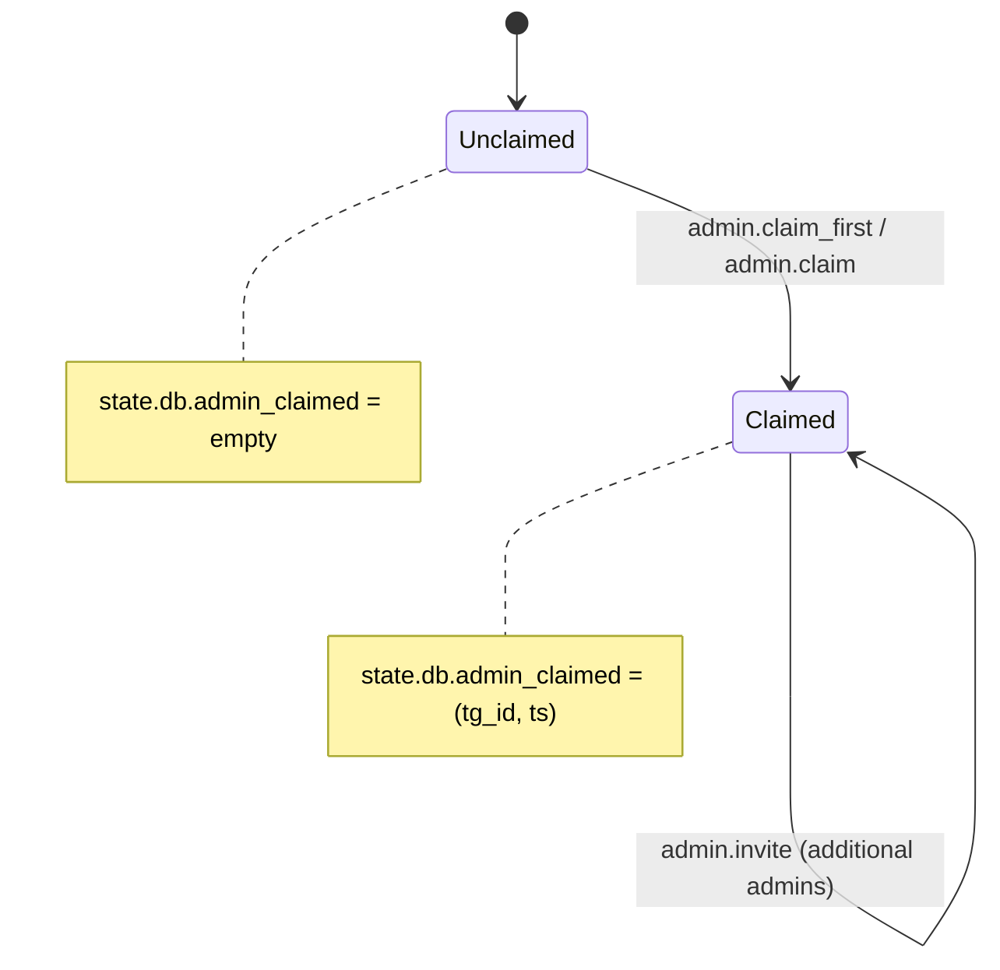
```mermaid
stateDiagram-v2
    [*] --> Unclaimed
    Unclaimed --> Claimed: admin.claim_first / admin.claim
    Claimed --> Claimed: admin.invite (additional admins)
    note right of Unclaimed: state.db.admin_claimed = empty
    note right of Claimed: state.db.admin_claimed = (tg_id, ts)
```

**Confirmation lifecycle:**

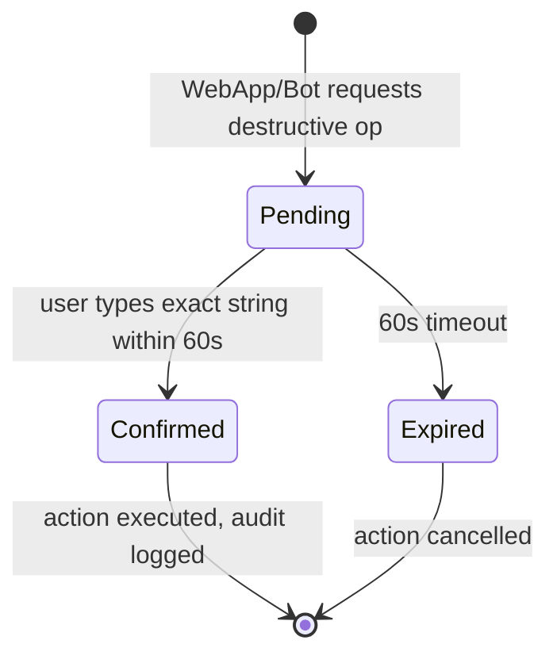
```mermaid
stateDiagram-v2
    [*] --> Pending: WebApp/Bot requests destructive op
    Pending --> Confirmed: user types exact string within 60s
    Pending --> Expired: 60s timeout
    Confirmed --> [*]: action executed, audit logged
    Expired --> [*]: action cancelled
```

### Invariants

1. `BOT_TOKEN` is **only** in `/etc/govless/bot.env` (mode 0600).
2. `state.db` writes go through `WAL` + `busy_timeout=5000` to survive concurrent readers.
3. Every RPC writes one row to `audit_log` (or fails before mutation).
4. `auth_date` in initData must be within 300s of server time.
5. `/run/govlessctl.sock` is 0660 root:govless — no world write.
6. `admin_claim_first_atomic` uses `BEGIN IMMEDIATE` — race-safe.
7. govlessctl never imports `auth.py` flat — always `from .auth import ...` (P1 fix B-A1).

---

## 12. Components

### 12.1 `govlessctl/daemon.py`

aiohttp HTTP server bound to UNIX socket `/run/govlessctl.sock`. Dispatches to `methods.py`.

```python
# Pseudocode
async def handle(request):
    body = await request.json()                  # JSON-RPC 2.0
    method_name = body["method"]
    params = body.get("params", {})
    headers = request.headers
    ctx = await auth.verify(headers, params)     # raises 401 if bad
    method = METHODS[method_name]                 # raises 404 if missing
    result = await method(params, ctx)
    audit.write(ctx, method_name, params, result)
    return json_response(jsonrpc_envelope(result))
```

Startup: opens `state.db` with `journal_mode=WAL`, `busy_timeout=5000`. Reads `BOT_TOKEN` from `/etc/govless/bot.env` (parses `KEY=VAL` lines).

### 12.2 `govlessctl/auth.py`

Implements Telegram WebApp `initData` HMAC verification per official spec:

```
secret_key = HMAC_SHA256(key="WebAppData", msg=BOT_TOKEN)
data_check_string = "\n".join(sorted([f"{k}={v}" for k,v in fields if k!="hash"]))
expected_hash = HMAC_SHA256(key=secret_key, msg=data_check_string).hex()
assert expected_hash == fields["hash"]
assert (now - int(fields["auth_date"])) < 300
```

For bot-originated calls (over unix socket from `bot.py`): trusts `tg_id` from `ctx`, since the socket is 0660 root:govless and only the bot process can connect.

For CLI calls: trusts root invocation (sets `ctx["tg_id"]` to a sentinel).

### 12.3 `govlessctl/state_db.py`

Wraps `state.db` with helper methods. Schema v2:

```sql
CREATE TABLE govless_admins (
    tg_id TEXT PRIMARY KEY,
    invited_by TEXT,
    invited_at INTEGER NOT NULL
);

CREATE TABLE admin_claimed (
    id INTEGER PRIMARY KEY CHECK (id = 1),
    claimed_by TEXT,
    claimed_at INTEGER
);

CREATE TABLE audit_log (
    ts INTEGER NOT NULL,
    by_tg_id TEXT,
    action TEXT NOT NULL,
    target TEXT,
    old_value TEXT,
    new_value TEXT,
    via TEXT  -- "bot" | "webapp" | "cli"
);
CREATE INDEX idx_audit_ts ON audit_log(ts);

CREATE TABLE subscription_tokens (
    name TEXT PRIMARY KEY,
    token TEXT NOT NULL,
    issued_at INTEGER NOT NULL
);

CREATE TABLE confirmations (
    nonce TEXT PRIMARY KEY,
    tg_id TEXT NOT NULL,
    action TEXT NOT NULL,
    target TEXT,
    expires_at INTEGER NOT NULL
);
```

Critical method:

```python
def admin_claim_first_atomic(self, tg_id):
    """Race-safe via BEGIN IMMEDIATE."""
    cur = self.conn.cursor()
    cur.execute("BEGIN IMMEDIATE")
    try:
        row = cur.execute("SELECT claimed_by FROM admin_claimed WHERE id=1").fetchone()
        if row and row["claimed_by"]:
            cur.execute("ROLLBACK")
            return False
        cur.execute("INSERT OR REPLACE INTO admin_claimed VALUES(1, ?, ?)",
                    (str(tg_id), int(time.time())))
        cur.execute("INSERT OR IGNORE INTO govless_admins VALUES (?, NULL, ?)",
                    (str(tg_id), int(time.time())))
        cur.execute("COMMIT")
        return True
    except Exception:
        cur.execute("ROLLBACK")
        raise
```

### 12.4 `govlessctl/methods.py`

Implements 22 RPC methods. Each method has signature `async def method_name(self, params: dict, ctx: dict) -> dict`. See [§13](#13-rpc-api-reference) for the full table.

Authorization decorator pattern (logical, not literal — uses inline checks):

```python
async def client_delete(self, params, ctx):
    self._require_admin(ctx)
    name = self._require_str(params, "name")
    confirm = self._require_str(params, "confirm")
    expected = f"DELETE {name}"
    if confirm != expected:
        raise MethodError(400, f"confirm must equal {expected!r}")
    client = self.xui.get_client_by_name(name)
    if not client:
        raise MethodError(404, "client not found")
    self.xui.delete_client(client["id"])
    self.state.audit(ctx["tg_id"], "client.delete", name,
                     old_value=json.dumps(client), new_value=None,
                     via=ctx.get("via", "unknown"))
    return {"ok": True}
```

### 12.5 `govlessctl/xui_client.py`

HTTP wrapper around 3X-UI panel API. Handles login (session cookie), CSRF, retries. Abstracts NewGen 3.x vs Legacy 2.x API differences (some endpoints renamed).

```python
class XUIClient:
    def __init__(self, url, username, password, version): ...
    def login(self) -> None: ...  # sets self.session_cookie
    def list_clients(self) -> list[dict]: ...
    def add_client(self, name: str, inbound_id: int, **opts) -> dict: ...
    def delete_client(self, client_id: str) -> None: ...
    def list_inbounds(self) -> list[dict]: ...
    def toggle_inbound(self, inbound_id: int, enable: bool) -> None: ...
    def get_panel_settings(self) -> dict: ...  # returns webPort, webBasePath, etc.
```

### 12.6 `govlessctl/cli.py`

Thin client. Reads `--arg key=value` args, builds JSON-RPC envelope, sends to `/run/govlessctl.sock`, prints response.

### 12.7 `bot/` package

- `bot.py` — entry point, reads `BOT_TOKEN`, builds `Dispatcher`, starts polling.
- `common.py` — shared `CONFIG`, `get_rpc()`, `render_main_menu()`, `is_admin()`.
- `rpc.py` — `RpcClient.call(method, params) -> dict`. Raises `RpcError(code, msg)` or `RpcTransportError`.
- `handlers/start.py` — `/start` with first-/start auto-claim.
- `handlers/menu.py` — `/menu` + inline keyboard callbacks.
- `handlers/clients.py` — client CRUD flows.
- `handlers/admin.py` — `/admins`, `/invite`.
- `handlers/confirm.py` — typed-confirm FSM, 60s TTL.
- `handlers/webapp.py` — `/webapp`, generates inline WebApp button.

### 12.8 `webapp/dist/`

- `index.html` — single-page shell.
- `style.css` — Telegram theme variables, mobile-first.
- `app.js` — 596 lines, vanilla JS, 6 views via hash routing.
- `manifest.json` — PWA manifest.
- `healthz` — static "ok".

---

## 13. RPC API reference

JSON-RPC 2.0 over UNIX socket.

Error codes: 400 bad request, 401 unauthorized, 403 forbidden, 404 not found, 409 conflict, 500 internal.

### Method catalog (22 methods)

| Method | Auth | Mutates | Description |
|--------|------|---------|-------------|
| `system.status` | none | no | `{panel_url, xray_running, x_ui_active, govlessctl_active, cert_expires_at?, tunnel_url?}` |
| `client.list` | admin | no | All clients: `{id, name, enabled, up_bytes, down_bytes, created_at}` |
| `client.add` | admin | yes | `{name}` → `{id, vless_url, qr_b64}` |
| `client.update` | admin | yes | `{name, enabled?}` → `{ok}` |
| `client.enable` | admin | yes | `{name}` → `{ok}` |
| `client.disable` | admin | yes | `{name}` → `{ok}` |
| `client.reset_traffic` | admin | yes | `{name}` → `{ok}` |
| `client.delete` | admin | **destructive** | `{name, confirm:"DELETE <name>"}` → `{ok}` |
| `client.qr` | admin | no | `{name}` → `{png_b64}` |
| `client.sub_url` | admin | no | `{name}` → `{url}` |
| `subscription.rotate` | admin | yes | `{name}` → `{url}` (new token) |
| `inbound.list` | admin | no | `[{id, port, protocol, transport, enable, ...}]` |
| `inbound.toggle` | admin | yes | `{port, enable}` → `{ok}` |
| `panel.access_get` | admin | no | `{url, username, password}` |
| `panel.access_set` | admin | yes | `{username?, password?}` |
| `audit.tail` | admin | no | `{limit?=20}` → `[{ts, by_tg_id, action, target, via}]` |
| `cert.force_renew` | admin | yes | `{}` → `{ok, new_expires_at}` (Pro only) |
| `admin.claim` | none + token | yes | `{tg_id, token}` legacy: requires `ADMIN_CLAIM_TOKEN` |
| `admin.claim_first` | none | yes | `{tg_id}` atomic first-/start claim |
| `admin.list` | admin (or empty) | no | `[{tg_id, invited_by, invited_at}]` |
| `admin.invite` | admin | yes | `{tg_id}` → `{ok}` |
| `tunnel.url_get` | admin | no | `{url}` |

### Authentication context

```python
{
    "tg_id": "12345" | None,
    "via": "bot" | "webapp" | "cli",
    "auth_date": int | None,
    "is_root": bool,
}
```

`_require_admin(ctx)` checks `ctx["tg_id"] in state.list_admin_ids()` or `ctx["is_root"]`.

### Idempotency

Most mutating methods are idempotent. Exception: `client.add` returns 409 if `name` collides.

---

## 14. Data model

### 14.1 state.db (govlessctl-owned)

Path: `/opt/govless/state.db`. Mode 0640, owner `govless:govless`. WAL.

(Full schema in §12.3 above.)

### 14.2 x-ui.db (3X-UI-owned)

Path: `/etc/x-ui/x-ui.db`. **goVLESS never writes directly** — always via 3X-UI HTTP API. Read-only tables we touch:

- `settings` — key/value (`webPort`, `webBasePath`, `tlsCertFile`, ...).
- `inbounds` — inbound configurations (JSON in `settings` column).
- `client_traffics` — per-client traffic stats.

For credentials lookup goVLESS does:

```python
con = sqlite3.connect("/etc/x-ui/x-ui.db")
rows = con.execute("SELECT key, value FROM settings WHERE key IN (?,?)",
                   ("webPort", "webBasePath")).fetchall()
```

### 14.3 Filesystem state

```
/etc/govless/
├── bot.env                       0600 root      BOT_TOKEN=...
└── tunnel.url                    0644 govless   current Cloudflare URL (one line)

/opt/govless/
├── config.json                   0644 root      install-time config
├── state.db                      0640 govless
├── state.db-wal                  0640 govless
├── state.db-shm                  0640 govless
└── webapp/dist/                  0755           static WebApp files

/run/govlessctl.sock              0660 root:govless   JSON-RPC server socket
```

### 14.4 Data flow for `client.add`

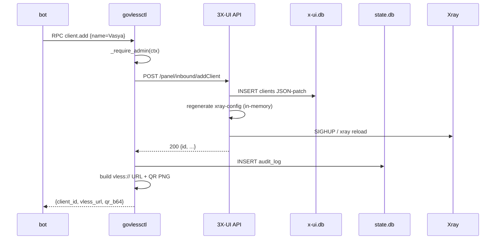
```mermaid
sequenceDiagram
    participant B as bot
    participant D as govlessctl
    participant X as 3X-UI API
    participant XDB as x-ui.db
    participant SDB as state.db
    participant XR as Xray
    B->>D: RPC client.add {name=Vasya}
    D->>D: _require_admin(ctx)
    D->>X: POST /panel/inbound/addClient
    X->>XDB: INSERT clients JSON-patch
    X->>X: regenerate xray-config (in-memory)
    X->>XR: SIGHUP / xray reload
    X-->>D: 200 {id, ...}
    D->>SDB: INSERT audit_log
    D->>D: build vless:// URL + QR PNG
    D-->>B: {client_id, vless_url, qr_b64}
```

---

## 15. Bot flows

### 15.1 First /start (admin claim)

`bot/handlers/start.py` (deployed, byte-verified 2026-05-16):

```python
@router.message(CommandStart())
async def cmd_start(message: Message):
    uid = str(message.from_user.id)
    admins = []
    try:
        admins = await get_rpc().call("admin.list", {})
    except RpcError as exc:
        LOG.warning("admin.list failed: %s", exc)

    if not admins and not CONFIG.admin_ids:
        # First /start in pristine state → atomic claim (no token needed).
        # Race-safe: BEGIN IMMEDIATE in state_db.admin_claim_first_atomic.
        try:
            await get_rpc().call("admin.claim_first", {"tg_id": uid})
        except RpcError as exc:
            if exc.code == 409:
                # Lost the race to another concurrent /start
                await message.answer(
                    "Этот бот уже занят другим администратором.\n"
                    f"Попроси его добавить тебя: твой Telegram ID <code>{uid}</code>",
                    parse_mode="HTML",
                )
                return
            await message.answer(f"Claim failed: {exc.message}")
            return
        except RpcTransportError as exc:
            await message.answer(f"govlessctl unreachable: {exc}")
            return
        CONFIG.admin_ids.add(uid)
        await message.answer(
            "✅ Ты назначен администратором этого бота.\n"
            f"Твой Telegram ID: <code>{uid}</code>\n\n"
            "Открываю меню...",
            parse_mode="HTML",
        )
        await render_main_menu(message)
    else:
        await message.answer(...)  # not admin → access denied
```

### 15.2 Typed-confirm FSM

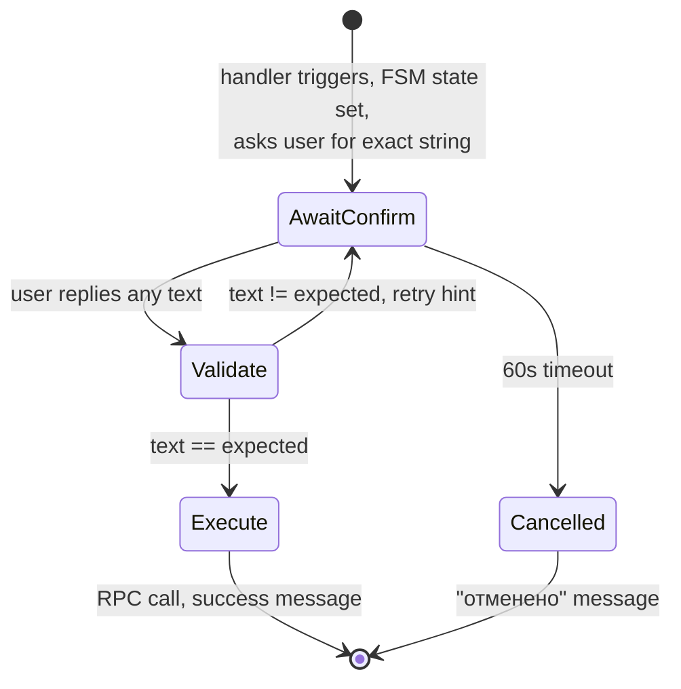
```mermaid
stateDiagram-v2
    [*] --> AwaitConfirm: handler triggers, FSM state set,<br/>asks user for exact string
    AwaitConfirm --> Validate: user replies any text
    Validate --> Execute: text == expected
    Validate --> AwaitConfirm: text != expected, retry hint
    AwaitConfirm --> Cancelled: 60s timeout
    Execute --> [*]: RPC call, success message
    Cancelled --> [*]: "отменено" message
```

State stored in aiogram's MemoryStorage `FSMContext`, keyed by `(chat_id, user_id)`. TTL enforced by background task setting state back to `None`.

### 15.3 WebApp button generation

```python
@router.message(Command("webapp"))
async def cmd_webapp(message: Message):
    if not is_admin(message.from_user.id):
        return await message.answer("Нет прав.")
    url = (await get_rpc().call("tunnel.url_get", {})).get("url")
    if not url:
        return await message.answer("Tunnel URL not ready yet.")
    kb = InlineKeyboardBuilder()
    kb.button(text="🌐 Открыть WebApp", web_app=WebAppInfo(url=url))
    await message.answer("Открыть мини-приложение:", reply_markup=kb.as_markup())
```

---

## 16. WebApp internals

### 16.1 Bootstrap

```html
<script src="https://telegram.org/js/telegram-web-app.js"></script>
<script src="app.js"></script>
```

```javascript
const tg = window.Telegram.WebApp;
tg.expand(); tg.ready();
const initData = tg.initData;  // raw query-string with HMAC hash

const rpc = {
    async call(method, params = {}) {
        const resp = await fetch("/rpc", {
            method: "POST",
            headers: {
                "Content-Type": "application/json",
                "X-Telegram-Init-Data": initData,
            },
            body: JSON.stringify({jsonrpc: "2.0", id: nextId(), method, params}),
        });
        const j = await resp.json();
        if (j.error) throw new RpcError(j.error.code, j.error.message);
        return j.result;
    }
};
```

### 16.2 Routing

Hash-based:

```
#/dashboard       → renderDashboard()
#/clients         → renderClientList()
#/clients/<id>    → renderClientCard(id)
#/inbounds        → renderInbounds()
#/admins          → renderAdmins()
#/system          → renderSystem()
```

### 16.3 Typed-confirm modal

```javascript
async function confirmModal({title, body, expected, ttl=60000}) {
    return new Promise((resolve) => {
        const modal = openModal({title, body});
        const input = modal.querySelector("input");
        const submit = modal.querySelector("button.submit");
        const cancelTimer = setTimeout(() => {
            closeModal(modal); resolve(null);
        }, ttl);
        submit.onclick = () => {
            if (input.value === expected) {
                clearTimeout(cancelTimer); closeModal(modal); resolve(input.value);
            } else {
                input.classList.add("error");
            }
        };
    });
}
```

### 16.4 nginx route table

```nginx
server {
    listen 127.0.0.1:8090;
    root /opt/govless/webapp/dist;
    index index.html;

    location / { try_files $uri $uri/ /index.html; }

    location /rpc {
        proxy_pass http://unix:/run/govlessctl.sock:/rpc;
        proxy_set_header X-Telegram-Init-Data $http_x_telegram_init_data;
        proxy_set_header Host $host;
    }

    location /healthz { return 200 "ok\n"; }
}
```

Cloudflare Quick Tunnel proxies `https://<random>.trycloudflare.com` → `http://127.0.0.1:8090`.

---

## 17. systemd units

### 17.1 Unit catalog

| Unit | Type | Purpose |
|------|------|---------|
| `govlessctl.service` | simple | Python daemon, JSON-RPC server |
| `govless-bot.service` | simple | aiogram long-poll |
| `cloudflared-quick.service` | simple | spawns `cloudflared tunnel --url http://127.0.0.1:8090` |
| `cloudflared-url.path` | path | watches journal for tunnel URL line |
| `cloudflared-url.service` | oneshot | extracts URL to `/etc/govless/tunnel.url` |
| `tunnel-health.timer` | timer | every 5 minutes |
| `tunnel-health.service` | oneshot | HTTP-pings tunnel URL, restarts cloudflared on failure |
| `govless-audit-prune.timer` | timer | daily |
| `govless-audit-prune.service` | oneshot | deletes audit_log rows older than 90d |
| `webapp-frontend.service` | oneshot | deploys static WebApp on boot (idempotent) |

### 17.2 Dependency graph

```mermaid
graph TB
    NETWORK[network-online.target] --> XU[x-ui.service]
    NETWORK --> CFQ[cloudflared-quick.service]
    XU --> D[govlessctl.service]
    D --> B[govless-bot.service]
    NETWORK --> N[nginx.service]
    N --> WFE[webapp-frontend.service]
    CFQ --> CFP[cloudflared-url.path]
    CFP --> CFU[cloudflared-url.service]
    TIMERS[timers.target] --> THT[tunnel-health.timer]
    THT --> THS[tunnel-health.service]
    TIMERS --> APT[govless-audit-prune.timer]
    APT --> APS[govless-audit-prune.service]
```

### 17.3 Hardening

```ini
[Service]
User=govless
Group=govless
DynamicUser=no
NoNewPrivileges=yes
ProtectSystem=strict
ProtectHome=yes
PrivateTmp=yes
ProtectKernelTunables=yes
ProtectKernelModules=yes
ProtectControlGroups=yes
RestrictAddressFamilies=AF_UNIX AF_INET AF_INET6
RestrictSUIDSGID=yes
LockPersonality=yes
RestrictRealtime=yes
SystemCallArchitectures=native
ReadWritePaths=/opt/govless /run/govlessctl
ReadOnlyPaths=/etc/govless
Restart=on-failure
RestartSec=5s
StartLimitIntervalSec=300
StartLimitBurst=5
```

### 17.4 Tunnel recovery loop

`govless-tunnel-health-check`:

```bash
#!/bin/bash
URL=$(cat /etc/govless/tunnel.url 2>/dev/null)
[ -z "$URL" ] && exit 1
# Cold-start grace: up to 30s for cloudflared if just (re)started
for i in {1..3}; do
    if curl -fsS --max-time 5 "$URL/healthz" >/dev/null; then exit 0; fi
    sleep 10
done
systemctl restart cloudflared-quick
```

Triggered by `tunnel-health.timer` every 5 minutes.

`StartLimitBurst=5` on `cloudflared-quick`: if it restarts >5× in 5min, systemd gives up — that's the escalation point (Phase B will push to Telegram).

---

## 18. Install pipeline

### 18.1 Bootstrap chain

```mermaid
flowchart TD
    A[bash bootstrap.sh] --> B[clone repo to /opt/govless-installer]
    B --> C[exec govless.sh]
    C --> D{First-time install?}
    D -->|yes| E[install_lite / install_pro]
    D -->|no| F[main_menu]
    E --> G[install 3X-UI + Xray]
    G --> H[configure inbound + Reality/TLS keys]
    H --> I[show QR codes]
    I --> J[Phase A install_phase_a.sh<br/>NOT auto-run, separate step]
```

### 18.2 Phase A install

```mermaid
flowchart TD
    A[install_phase_a.sh] --> B[install_dependencies<br/>apt-get python3.10 sqlite3 dnsutils ...]
    B --> C[install_govless_user<br/>useradd -r govless]
    C --> D[init_state_db<br/>creates schema v2]
    D --> E[deploy_govlessctl]
    E --> F[deploy_bot]
    F --> G[deploy_webapp]
    G --> H[install_cloudflared<br/>download binary]
    H --> I[install_systemd_units]
    I --> J[install_nginx_config]
    J --> K[prompt BOT_TOKEN → write /etc/govless/bot.env]
    K --> L[systemctl daemon-reload + enable + start]
    L --> M[wait_for_tunnel_url up to 60s]
    M --> N[print summary]
```

### 18.3 Idempotency rules

- Re-running install_phase_a.sh **must not** clobber `state.db`, `bot.env`, or `tunnel.url`.
- File copies use `install -m` with explicit mode/owner.
- Sentinel: presence of `/opt/govless/state.db` → skip init_state_db (but verify schema version).
- BOT_TOKEN prompt: only if `bot.env` missing or `BOT_TOKEN=` empty.

### 18.4 GH_TOKEN sanitization

```bash
git -c http.https://github.com/swr8bit/go-v.git.extraHeader="Authorization: Bearer $GH_TOKEN" \
    clone https://github.com/swr8bit/go-v.git /opt/govless-installer
```

Token never lands in `.git/config` or stderr.

---

## 19. Security model

### 19.1 Threat model

In scope:
- T1: Untrusted Telegram users probing the bot.
- T2: Untrusted internet attackers probing the public IP + tunnel URL.
- T3: Local users on the VPS without root.
- T4: Compromised dependencies (Python pkgs, 3X-UI, Xray).
- T5: Operator accidents.

Out of scope: VPS root compromise, Telegram account theft, Cloudflare being malicious, kernel-level exploits.

### 19.2 Defense matrix

| Defense | Counters |
|---------|----------|
| HMAC initData verification | T1, T2 forging WebApp requests |
| `auth_date` ≤ 300s | T2 replay attacks |
| `BOT_TOKEN` 0600 root | T3 reading the secret |
| `/run/govlessctl.sock` 0660 root:govless | T3 calling RPC directly |
| Typed-confirm | T5 fat-finger; T1 prompt injection |
| Atomic `admin_claim_first` | T1 concurrent /start race |
| Audit log 90d | forensics on T1-T5 |
| systemd hardening | T4 limiting blast radius |
| nginx serves only static + /rpc | T2 attacking app server |

### 19.3 Secrets inventory

| Secret | Where | Mode | Rotation |
|--------|-------|------|----------|
| BOT_TOKEN | `/etc/govless/bot.env` | 0600 root | manual via BotFather |
| 3X-UI panel password | `/etc/x-ui/x-ui.db` (bcrypt) + `/root/.govless_credentials` | 0600 root | via panel UI |
| Reality private key | inside `x-ui.db` settings JSON | DB-owned | regenerate via 3X-UI |
| Let's Encrypt private keys | `/etc/letsencrypt/live/<domain>/` | 0600 root | auto-renewed |
| Subscription token | `state.db.subscription_tokens` | DB-owned | `subscription.rotate` |
| Cloudflare tunnel URL | `/etc/govless/tunnel.url` | 0644 govless | per cloudflared restart |

### 19.4 Audit guarantees

- Every mutating RPC writes one `audit_log` row **after** the mutation succeeds.
- Failed auth requests are journald-logged, not in audit_log.
- Audit rows not cryptographically signed — relies on filesystem integrity. **Phase B planned**: hash-linked rows.

### 19.5 Known accepted risks

Per `ai-bridge/claude-codex/017-architect-codex-016-response.md`:

1. **Audit log post-v1 integrity** — accepted-as-risk; mitigated by daily backup.
2. **No 2FA on admins** — Telegram account = sufficient for v1.
3. **Cloudflare as TLS terminator (Quick Tunnel)** — explicit trust; mitigation = use own domain.

---

## 20. Development guide

### 20.1 Local dev setup

```bash
git clone https://github.com/swr8bit/go-v
cd goVLESS

python3 -m pip install ruff --break-system-packages
ruff check phase-a/

python3 -m py_compile phase-a/govlessctl/*.py phase-a/bot/*.py phase-a/bot/handlers/*.py
```

### 20.2 Test VPS

```bash
ssh root@<vps>
bash <(curl -sL https://raw.githubusercontent.com/anten-ka/goVLESS/main/bootstrap.sh)
cd /opt/govless-installer
bash phase-a/systemd/install/install_phase_a.sh
```

### 20.3 Adding a new RPC method

1. Add `async def my_method(self, params, ctx)` to `phase-a/govlessctl/methods.py`.
2. Register in dispatch dict: `"namespace.my_method": self.my_method`.
3. Add audit logging.
4. If destructive, require typed-confirm.
5. Add bot handler / WebApp view as needed.
6. Update §13 table here.
7. `python3 -m py_compile` + deploy to test VPS.

### 20.4 Test matrix

| Test | Method |
|------|--------|
| Lite × NewGen × {TCP,XHTTP,gRPC} | install on fresh VPS, connect via V2RayNG |
| Lite × Legacy × {TCP,XHTTP,gRPC} | NewGen → Legacy at install prompt |
| Pro × {NewGen,Legacy} × {TCP,XHTTP,gRPC} | needs domain + DNS A record |
| Bot first-/start admin claim | clear `admin_claimed`, /start |
| Concurrent /start race | 2 telegram accounts, simultaneous /start |
| Typed-confirm delete | bot + WebApp paths |
| Tunnel recovery | `systemctl stop cloudflared-quick`, wait up to 10 minutes |
| Audit prune | set `expires_at` to past, run prune service |

### 20.5 Architect ↔ Reviewer protocol

1. Architect (Claude) writes proposal `NNN-architect-<topic>.md` and commits.
2. Reviewer (Codex) audits → `NNN+1-codex-<topic>.md` with P0/P1/P2/P3 findings.
3. Architect responds → `NNN+2-architect-<response>.md`, fixing P0/P1.
4. Repeat until Reviewer GO.
5. Human gate for production deploys.

P-severity:
- **P0** — security or data-loss critical; blocks release.
- **P1** — functional bug or significant security weakness; blocks release.
- **P2** — quality / robustness; fix-if-time.
- **P3** — cosmetic.

### 20.6 Commit message conventions

- Subject: imperative, ≤72 chars.
- Body: what + why.
- Reference bridge file: `Per ai-bridge/claude-codex/016 P1 #2.`
- Author identity: `Claude (Architect) <claude@anten-ka.com>`.

### 20.7 What lives where (cheat sheet)

| Want to change… | Edit… |
|-----------------|-------|
| RPC method | `phase-a/govlessctl/methods.py` |
| state.db schema | `phase-a/govlessctl/state_db.py` + bump schema_version |
| 3X-UI API call | `phase-a/govlessctl/xui_client.py` |
| HMAC verification | `phase-a/govlessctl/auth.py` |
| Bot command | `phase-a/bot/handlers/*.py` + register in `bot.py` |
| WebApp view | `phase-a/webapp/dist/app.js` |
| WebApp style | `phase-a/webapp/dist/style.css` |
| systemd unit | `phase-a/systemd/*.service` or `*.timer` |
| Install script | `phase-a/systemd/install/install_phase_a.sh` |
| nginx route | `phase-a/systemd/nginx/govless-webapp.conf` |

### 20.8 Cross-cutting concerns

- **Logging:** `logging.getLogger(__name__)`, level via `LOG_LEVEL` env. systemd captures stdout/stderr to journald.
- **Errors:** raise `MethodError(code, message)` for client-visible errors. Daemon catches Python tracebacks → returns 500 with generic message.
- **Async:** all govlessctl methods are `async def` even if no IO.
- **SQLite:** `with self.conn:` for transactions; `?`-binding (never f-string SQL).
- **Subprocess:** `subprocess.run(args_list, shell=False)`.

---

## 📌 Appendix A — File inventory

```
goVLESS/
├── README.md
├── CLAUDE.md
├── GOVLESS_DOCS.md                        legacy v3 bash-installer docs
├── AUDIT_GUIDE.md                         guide for Codex reviewer
├── PROMPT_FOR_NEW_CHAT.md
│
├── bootstrap.sh                           one-shot installer launcher
├── govless.sh                             main bash installer (legacy v3)
├── install.sh
├── deploy_pro.sh
├── self_signed_cert.sh
├── test_*.sh                              smoke tests
├── templates_catalog.json                 ~1800 HTML site templates index
│
├── lib/                                   bash modules (common.sh, i18n.sh, xui.sh ...)
│
├── phase-a/                               Phase A — Telegram control plane
│   ├── CONTRACT.md                        shared interface contract for sub-agents
│   ├── govlessctl/                        Python daemon
│   │   ├── auth.py, cli.py, daemon.py
│   │   ├── methods.py                     22 RPC methods
│   │   ├── state_db.py, xui_client.py
│   │   └── requirements.txt
│   ├── bot/                               aiogram v3
│   │   ├── bot.py, common.py, rpc.py
│   │   ├── handlers/{start,menu,clients,admin,confirm,webapp}.py
│   │   └── requirements.txt
│   ├── webapp/dist/                       vanilla HTML/CSS/JS
│   └── systemd/
│       ├── *.service, *.timer, *.path
│       ├── nginx/govless-webapp.conf
│       ├── bin/govless-*                  helper bash scripts
│       └── install/
│           ├── install_phase_a.sh
│           ├── install_cloudflared.sh
│           └── install_govless_user.sh
│
├── ai-bridge/claude-codex/                Architect ↔ Reviewer history (001-017)
│
└── docs/
    ├── DOCUMENTATION.md                   ← this file
    └── assets/
```

---

## 📌 Appendix B — Glossary

| Term | Meaning |
|------|---------|
| **VLESS** | VPN protocol; minimalist, designed for Xray, no AEAD overhead |
| **Reality** | Xray's masking tech; spoofs handshake as another TLS site |
| **XHTTP / gRPC** | transport modes mimicking HTTP/2 traffic |
| **3X-UI** | Web panel for managing Xray |
| **inbound** | Xray's listening configuration (port + protocol + transport) |
| **initData** | Telegram WebApp's HMAC-signed authentication payload |
| **HMAC-SHA256** | Hash-based message authentication |
| **BEGIN IMMEDIATE** | SQLite transaction mode that acquires write-lock at start |
| **typed-confirm** | UI pattern requiring exact string echo before destructive action |
| **Quick Tunnel** | Cloudflare service providing ephemeral HTTPS URLs without account |
| **JSON-RPC 2.0** | spec for RPC over JSON; govlessctl's wire protocol |
| **Architect / Reviewer** | roles in `coordinating-ai-duos` skill; Claude proposes, Codex audits |

---

## 📌 Appendix C — Bridge file history (ai-bridge/claude-codex/)

| # | Author | Topic |
|---|--------|-------|
| 001 | Architect | Rebrand proposal XUIFAST → goVLESS |
| 002 | Reviewer | Audit commit A |
| 003 | Architect | Fix report commit A |
| 004 | Architect | Response to audit 002 |
| 005 | Architect | Test fixes pass 1 |
| 006 | Architect | Test report scenario 1 |
| 007 | Codex (product) | TG bot menu note |
| 008 | Architect | Test report all scenarios |
| 010 | Architect | Matrix test report |
| 011 | Architect | Open questions resolved |
| 012 | Reviewer | Final audit |
| 013 | Architect | Audit response |
| 014 | Architect | TG bot proposal |
| 015 | Reviewer | Bot proposal audit request |
| 016 | Reviewer | Post-fixes + bot proposal audit |
| 017 | Architect | Response to Codex 016 |
| 018 | Reviewer | Menu UX & mode switching architecture proposal |
| 019 | Reviewer | DNS-wait + private-update UX (P1) |
| 020 | Architect | Response 018+019 + B0→B4 phasing |
| 021 | Architect | Changes since 020, audit-requested |
| 022 | Reviewer | NO-GO, 2 P1 + 4 P2 + 3 P3 |
| 023 | Architect | All 9 of 022 fixed |
| 024 | Architect | Repair menu + subs.json mktemp fix |
| 025 | Reviewer | NO-GO subscriptions+repair (P1: sub-server unreachable on first install) |
| 026 | Reviewer | Fix-report after parallel-agent audit |
| 027 | Architect | GO on 026 + subscription exposure model |
| 028 | Architect | 15-section test plan agreement + 7 additions |
| 029 | Reviewer | Live VPS tests + subId=empty fix |
| 030 | Architect | Branch strategy clarify (2-branch dev/main confirmed) |
| 031 | Reviewer | Phase-A install + audit migration + admin reload + xui creds (4 P1) |
| 032 | Reviewer | Telegram bot menu UX rewrite |
| 033 | Architect | Full sync done, review request |
| 034 | Reviewer | Audit 033: certbot hook unreachable (1 P1) |
| 035 | Reviewer | Phase-A v3 API + mode-switch rollback (9 P1 + 3 P2) |
| 036 | Architect | GO on 034+035 + disclaimer for review |

(Number 009 was skipped intentionally during the matrix-test cycle.)

### Где живёт переписка

- Только на ветке `dev` (`ai-bridge/claude-codex/`)
- НЕ попадает к тестерам через `bootstrap.sh` (он клонит только `main`)
- Полная история решений + WHY каждого изменения

Получить:
```bash
git clone -b dev https://github.com/swr8bit/go-v.git
cd goVLESS/ai-bridge/claude-codex
ls  # 36+ файлов от 001 до 036+
```

---


## 📌 Appendix D — Current menu tree (v1.0-rc1)

Полная карта меню SSH `govless` после всех обновлений:

```
goVLESS Dashboard (главный экран)
│
├── 1) VPN (proxy)
│     ├── 1) Установить / Обновить         ── select_and_install (+ disclaimer gate first time)
│     ├── 2) Перезапуск                   ── restart_xui
│     ├── 3) Логи                         ── xui_logs 50
│     └── 4) Сменить режим                ── switch_mode_interactive (Lite↔Pro)
│
├── 2) Пользователи (users)
│     ├── 1) Список пользователей          ── show_all_users_formatted
│     ├── 2) Показать ссылки              ── всех клиентов как vless:// + sub URLs
│     ├── 3) Показать QR-коды             ── per-client: subscription / direct / both
│     └── 4) Обновить ссылки из 3X-UI     ── regenerate_links_from_db
│
├── 3) Управление (manage)
│     ├── 1) Язык                          ── pick_language_interactive
│     ├── 2) Перезапуск                    ── restart_xui
│     ├── 3) 🔧 Repair                     ── repair_user_facing (IP+sub+links)
│     ├── 4) 📦 Backup                     ── backup_govless (WAL-safe tgz)
│     ├── 5) 📥 Restore                    ── restore_govless (pick from list)
│     └── 6) 🗑 Remove                     ── submenu_remove
│             ├── 1) Только сайт           ── remove_site_only (cert in-use guard)
│             ├── 2) Только панель         ── remove_panel_only
│             └── 3) ВСЁ (necromancer)    ── remove_everything (typed-confirm + failure summary)
│
├── 4) Telegram-бот (bot)
│     ├── 1) Токен бота               ── bot_set_token (формат + getMe)
│     ├── 2) Администраторы           ── bot_manage_admins (ADMIN_IDS)
│     ├── 3) Статус бота              ── bot_show_status (сервисы + getMe)
│     └── 4) Перезапустить бота       ── bot_restart (govlessctl + govless-bot)
│
└── 5) About
      ├── Версия + lib stack
      └── Disclaimer (info-only render)
```

### Phase A (Telegram-bot) меню

```
goVLESS bot (Telegram)
│
├── /start                                 первый = админ через admin.claim_first (atomic)
│
├── 👥 Клиенты
│     ├── Список → карточка клиента → действия:
│     │     ├── 📷 QR (sub-first if available, else direct)
│     │     ├── 🔗 Subscription URL
│     │     ├── 🔗 Direct VLESS link
│     │     ├── ⏸ Disable / ▶ Enable
│     │     ├── 🔄 Reset traffic (typed-confirm)
│     │     ├── ✏ Set limit (typed-confirm if big change)
│     │     ├── 📅 Set expiry (typed-confirm)
│     │     ├── 🗑 Delete (typed-confirm: "DELETE <name>")
│     │     └── 🔃 Rotate subscription (issues fresh subId)
│     └── ➕ Add client
│
├── 📡 Inbounds (list + toggle enable/disable)
│
├── ⚙ Mode & Access
│     ├── Lite ↔ Pro switch
│     ├── Quick Tunnel on/off
│     └── Panel access mode
│
├── 👮 Bot admins
│     ├── /invite <tg_id>
│     └── /admins (list)
│
└── 🔧 System
      ├── /status (services + uptime + IP)
      ├── /audit [N] (last N audit_log rows)
      └── /webapp (open WebApp button)
```

### Что появилось в v1.0-rc1

- **🔧 Repair** в Manage (раньше не было — был обязательный re-install)
- **📦 Backup / 📥 Restore** в Manage (раньше был только сторонний cron-скрипт на ноуте)
- **🗑 Remove submenu** с 3 вариантами + typed-confirm (раньше был один пункт «remove all»)
- **Disclaimer gate** перед первым install (раньше не было)
- **«Сменить режим»** работает реально (раньше зацикливался на «install заново»)
- **Subscription / Direct / Both picker** в Show QR (раньше всегда direct)
- **«Invalid input»** теперь остаётся в текущем меню вместо выкидывания в main

---

## 📌 Appendix E — Test regressions (release gate)

`test_regressions.sh` — 80+ source-level проверок. Запускается локально перед каждым релизом + автоматически после `bootstrap.sh` в install_phase_a. Покрытие:

| Категория | Тестов |
|-----------|--------|
| bash syntax всех критичных файлов | 1 |
| Disclaimer i18n parity (23 ключа × 2 языка + 3 поведенческих) | 4 |
| ensure_client_subids semantics (fill + rotate preserve) | 2 |
| mode_switch rollback (snapshot before delete, restore on fail) | 2 |
| Subscription URLs generation contract | 4 |
| Phase-A v3 API (CSRF + endpoints + payload normalization) | 4 |
| typed-confirm transport через RPC 412 + confirm_token | 3 |
| Template picker retry loop + EN tplcat i18n | 2 |
| backup_govless WAL safety | 1 |
| certbot deploy_hook installation order | 1 |
| nginx security headers presence | 1 |
| regen Python graceful malformed-row handling | 1 |
| remove_try wiring в remove_everything | 1 |
| build_sub_url dead code (отсутствие) | 1 |
| Phase-A installer deploys runnable bot/govlessctl/WebApp | 1 |
| Phase-A state.db legacy audit schema migration | 1 |
| Phase-A bot reloads persisted admins on restart | 1 |
| Phase-A XuiClient honors goVLESS credentials | 1 |
| RU/EN i18n key parity (общий) | 1 |
| ...плюс ~40 точечных регрессий из 022/025/026/029 audit циклов |

Запуск: `bash test_regressions.sh` (выход 0 = release-ready).

---

_End of documentation. ≈ 56 KB._
_If a section is wrong or out of date — file an issue or `/feedback` in the bot._
